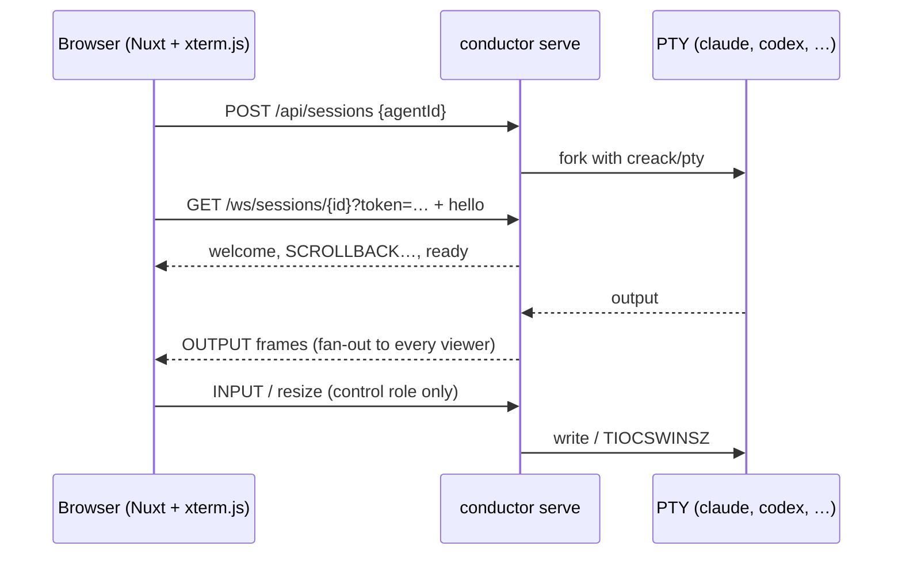
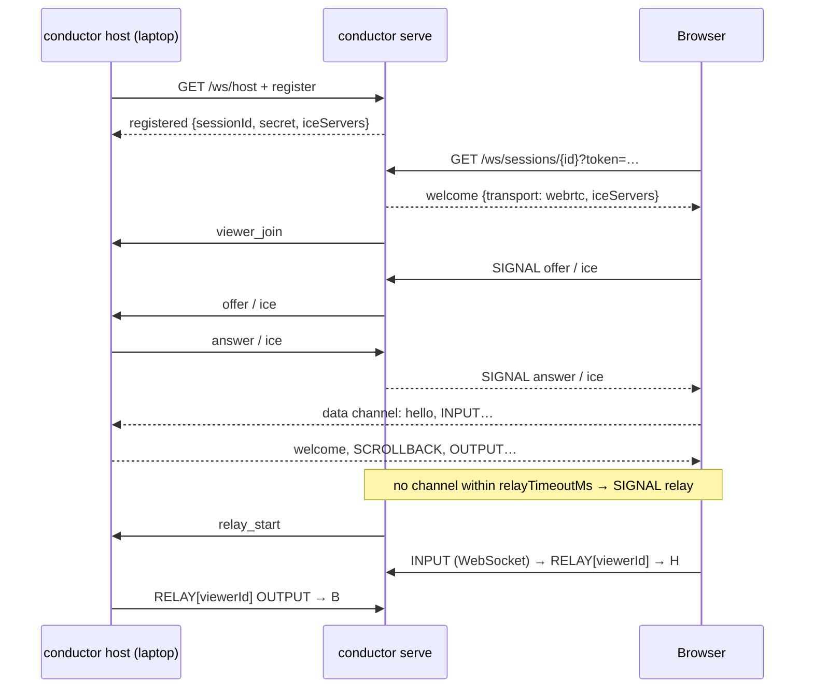

# Architecture

Conductor is one Go binary plus an embedded Nuxt single-page app. It runs in two
roles.

## Server-hosted sessions

`internal/session.Local` owns the PTY: a pump goroutine copies output into a
256 KiB ring buffer and broadcasts it to subscribers. Each subscriber has its own
bounded queue; exceeding 1 MiB of backlog evicts it as a slow consumer, and the
client reconnects to get a fresh replay.

## Developer-hosted sessions

The host reuses `session.Local` unchanged; only the sinks differ (a pion data
channel with backpressure, or a relay sink that wraps frames in RELAY envelopes).
The server never sees terminal bytes on the WebRTC path and never runs the
command.

## Packages

| Package | Responsibility |
|---|---|
| `cmd/conductor` | entry point; `serve`, `host`, `version` |
| `internal/cli` | flag parsing only |
| `internal/config` | JSON config, `CONDUCTOR_*` overrides, validation |
| `internal/catalog` | launchable agents (argv arrays, never shell strings) |
| `internal/proto` | frame codec and message structs (mirrored in `web/app/utils/protocol.ts`) |
| `internal/pty` | process start, resize, stop; environment allowlist |
| `internal/session` | ring buffer, fan-out hub, `Local` session, registry, bounded file reads |
| `internal/share` | share tokens (random, hashed at rest) and revocation |
| `internal/signal` | hosted sessions: host connections, viewer brokering, relay |
| `internal/api` | HTTP routes, admin/share/host authentication, viewer and host WebSockets |
| `internal/hostagent` | `conductor host`: control connection, pion peers, relay, local terminal |
| `internal/web` | embedded SPA with index fallback |
| `web/` | Nuxt 4 + Nuxt UI 4 + xterm 6 workbench |

## Security model

- The admin token protects launching, listing, stopping and link management.
- Share links carry their own 256-bit token; only its SHA-256 is stored. A link
  grants `view` or `control` on exactly one session and can be revoked, which
  disconnects its viewers immediately.
- Host tokens allow registering hosted sessions. A host never receives admin or
  share tokens.
- Commands are argv arrays from the catalog; user-supplied extra arguments are
  appended element-wise only for agents that allow it. Server sessions get an
  allowlisted environment; `CONDUCTOR_*` never reaches a child.
- Server session working directories must resolve under `allowedRoots` after
  symlink evaluation. File reads are confined to the session directory.
- Frame sizes, viewer counts, session counts, scrollback and in-flight file
  requests are all bounded. Query strings (which may carry tokens) are never
  logged.

## Persistence

None in v1. Sessions and links live in memory; a server restart ends server
sessions and forgets links. Hosted sessions survive a brief server outage through
the host's reconnect-and-resume secret only while the server process is alive.
