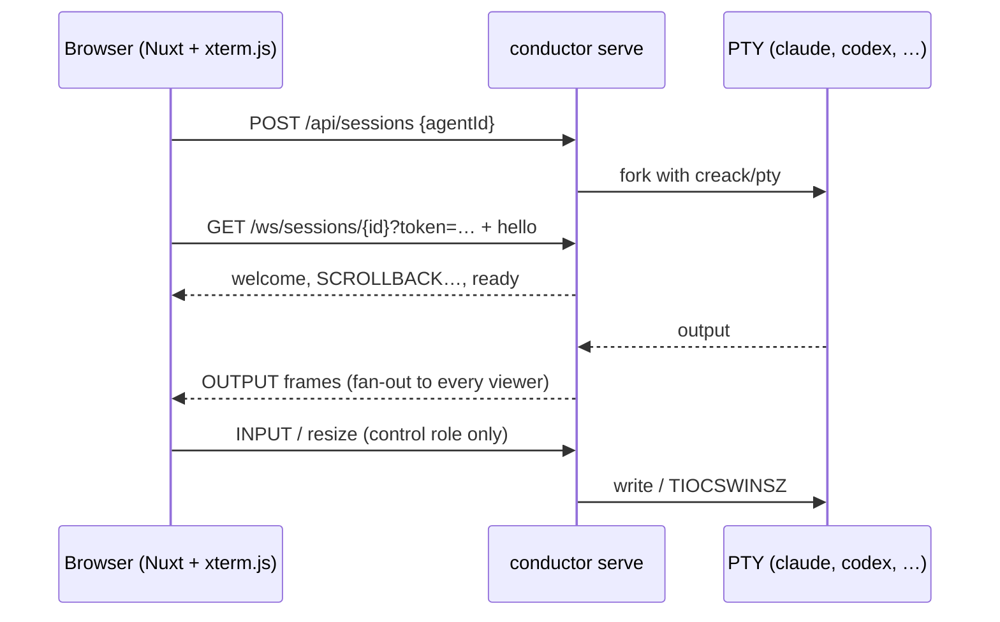
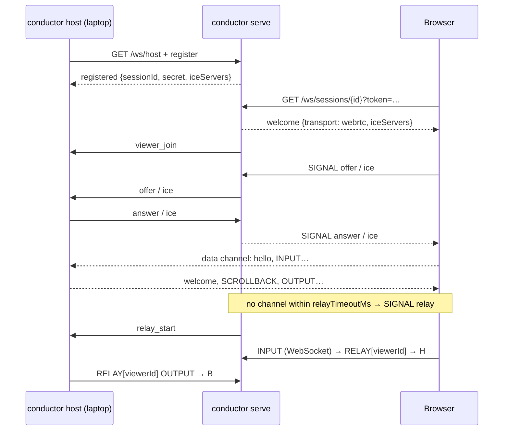

# Architecture

Conductor is one Go binary plus an embedded Nuxt single-page app. It runs in two
roles.

## Server-hosted sessions

```mermaid
sequenceDiagram
  participant B as Browser (Nuxt + xterm.js)
  participant S as conductor serve
  participant P as PTY (claude, codex, …)
  B->>S: POST /api/sessions {agentId}
  S->>P: fork with creack/pty
  B->>S: GET /ws/sessions/{id}?token=… + hello
  S-->>B: welcome, SCROLLBACK…, ready
  P-->>S: output
  S-->>B: OUTPUT frames (fan-out to every viewer)
  B->>S: INPUT / resize (control role only)
  S->>P: write / TIOCSWINSZ
```

`internal/session.Local` owns the PTY: a pump goroutine copies output into a
256 KiB ring buffer and broadcasts it to subscribers. Each subscriber has its own
bounded queue; exceeding 1 MiB of backlog evicts it as a slow consumer, and the
client reconnects to get a fresh replay.

## Developer-hosted sessions

```mermaid
sequenceDiagram
  participant H as conductor host (laptop)
  participant S as conductor serve
  participant B as Browser
  H->>S: GET /ws/host + register
  S-->>H: registered {sessionId, secret, iceServers}
  B->>S: GET /ws/sessions/{id}?token=…
  S-->>B: welcome {transport: webrtc, iceServers}
  S->>H: viewer_join
  B->>S: SIGNAL offer / ice
  S->>H: offer / ice
  H->>S: answer / ice
  S-->>B: SIGNAL answer / ice
  B-->>H: data channel: hello, INPUT…
  H-->>B: welcome, SCROLLBACK, OUTPUT…
  Note over B,S: no channel within relayTimeoutMs → SIGNAL relay
  S->>H: relay_start
  B->>S: INPUT (WebSocket) → RELAY[viewerId] → H
  H->>S: RELAY[viewerId] OUTPUT → B
```

The host reuses `session.Local` unchanged; only the sinks differ (a pion data
channel with backpressure, or a relay sink that wraps frames in RELAY envelopes).
The server never sees terminal bytes on the WebRTC path and never runs the
command.

## Crew runs

A crew run is `internal/crew`'s `Engine`, and every member is an ordinary
server session: the engine starts it through the `Launcher` interface, which
`internal/api` implements with `createLocalSession`, the one path
`POST /api/sessions` takes, so the working-directory check, the catalog
lookup, the environment and the hook injection are the same as for any
session. The session carries its run in `Info.crew`, and its process gets
`CONDUCTOR_CREW`, `CONDUCTOR_RUN`, `CONDUCTOR_MEMBER` and `GOAL`. With
worktree isolation the engine first runs `git worktree add` (argv, never a
shell) and starts the member in its own worktree under
`<cwd>/.conductor/worktrees`; it never removes one. A launch returns once the
sessions exist; a goroutine per member, on the run's own context, then waits
until the session is ready (its agent reports `needs_input` or `done`, or its
output goes quiet) and types the role prompt with `Local.Type`. The engine
listens through two hooks that never wait: a sink on the activity fan-out
(`Engine.OnActivity`, beside the webhooks) sees every entry of every session,
starts the `after` members when a member first reports `done` and takes a
member's `handoff` events, and the session change hook (`Engine.OnChange`,
chained after the SSE publish) wakes the handoffs queued for a member when it
leaves `needs_input`: a prompt that is cleared records no entry, only a change.
Handoffs and broadcasts are typed with `Local.TypeUnlessWaiting`, which looks
at the attention state in the same step that finds the prompt a write would
answer, so neither ever answers a prompt. Runs live in memory, as sessions do;
run links are share-store links scoped to a run (`Link.RunID`), which the
server resolves to the run's member sessions through `Engine.MemberOf`.

## Packages

| Package | Responsibility |
|---|---|
| `cmd/conductor` | entry point; `serve`, `host`, `notify`, `hooks`, `skill`, `up`, `crews`, `completion`, `version` |
| `internal/cli` | flag parsing, help and completion text (the completion table and scripts, the rc-file line); no business logic |
| `internal/config` | JSON config, `CONDUCTOR_*` overrides, validation |
| `internal/catalog` | launchable agents (argv arrays, never shell strings) |
| `internal/store` | atomic JSON documents in the data directory |
| `internal/agents` | hook adapters per agent: assets under `dataDir/hooks`, launch injection, on-demand install, payload mappers |
| `internal/crew` | saved crews, one file each in `dataDir/crews/`: members, role prompts, start conditions, validation; runs: member sessions through the server's launch path, git worktrees, readiness, prompts, start conditions, handoffs between members (an activity sink and a change hook of `internal/api`) |
| `internal/proto` | frame codec and message structs (mirrored in `web/app/utils/protocol.ts`) |
| `internal/pty` | process start, resize, stop; environment allowlist |
| `internal/session` | ring buffer, fan-out hub, `Local` session, registry, bounded file reads |
| `internal/share` | share tokens (random, hashed at rest) and revocation |
| `internal/signal` | hosted sessions: host connections, viewer brokering, relay |
| `internal/api` | HTTP routes, admin/share/host authentication, viewer and host WebSockets |
| `internal/hostagent` | `conductor host`: control connection, pion peers, relay, local terminal |
| `internal/web` | embedded SPA with index fallback |
| `web/` | Nuxt 4 + Nuxt UI 4 + xterm 6 workbench |

## Security model

- The admin token protects launching, listing, stopping, link management and
  editing the agent catalog, which is as powerful as the server user: a saved
  agent's argv and env run as that user.
- Share links carry their own 256-bit token; only its SHA-256 is stored. A link
  grants `view` or `control` on exactly one session, or, for a run link, on
  every member session of its run, and can be revoked, which
  disconnects its viewers immediately.
- Host tokens allow registering hosted sessions. A host never receives admin or
  share tokens.
- Commands are argv arrays from the catalog; user-supplied extra arguments are
  appended element-wise only for agents that allow it. Server sessions get an
  allowlisted environment; `CONDUCTOR_*` from the server's own environment never
  reaches a child, and Conductor sets only the few a session needs itself.
- Server session working directories must resolve under `allowedRoots` after
  symlink evaluation. File reads are confined to the session directory. In
  server sessions they never reach the data directory, the config file or the
  catalog file, even when those lie inside it; a hosted session serves
  everything under its working directory.
- Frame sizes, viewer counts, session counts, scrollback and in-flight file
  requests are all bounded. Query strings (which may carry tokens) are never
  logged.

## Persistence

Sessions, links and crew runs remain in memory, while the data directory
(`dataDir`) holds UI-managed state as JSON files, saved crews included. A
server restart ends server sessions and forgets links and runs (worktrees and
their branches stay on disk). Hosted sessions survive a brief server outage
through the host's reconnect-and-resume secret only while the server process is
alive.
