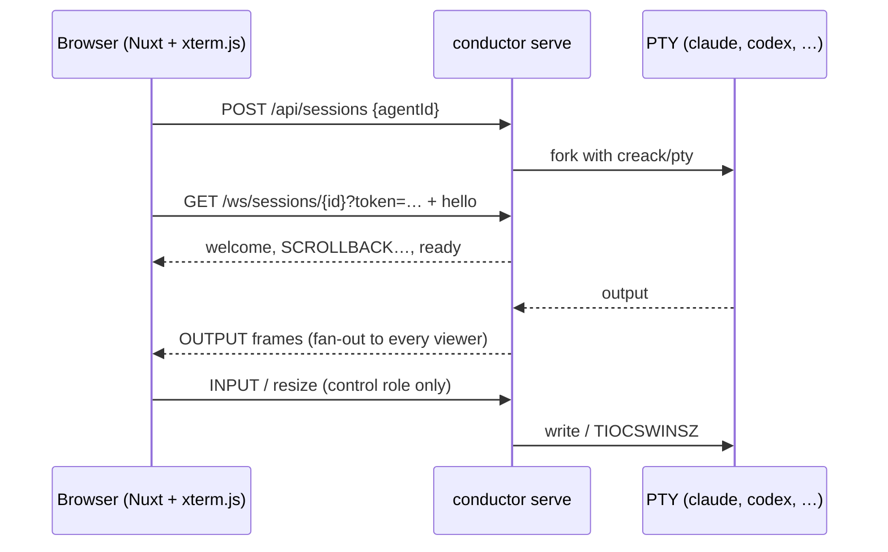
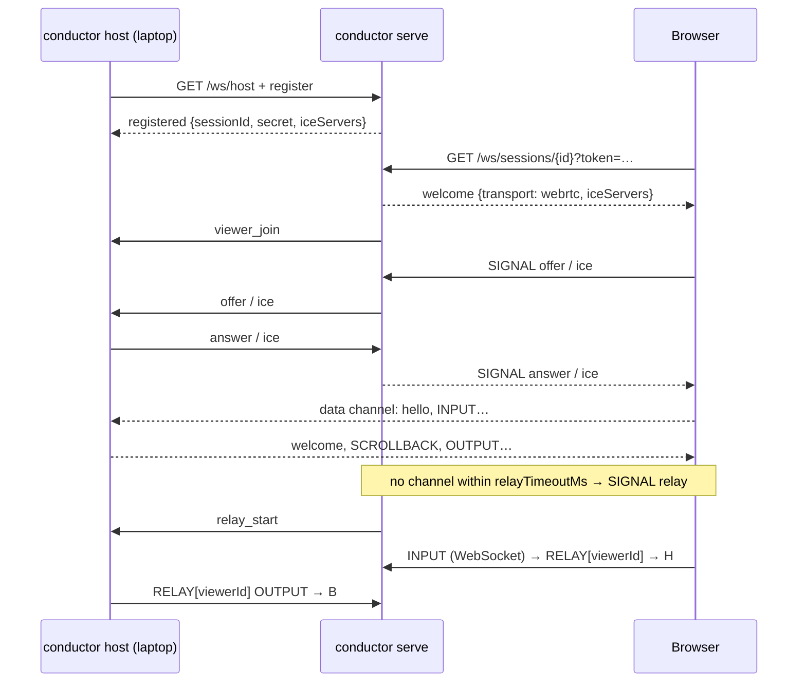

# Architecture

Conductor is one Go binary plus an embedded Nuxt single-page app. It runs in two
roles.

## Server-hosted sessions

```mermaid
sequenceDiagram
  participant B as Browser (Nuxt + xterm.js)
  participant S as conductor serve
  participant P as PTY (claude, codex, …)
  B->>S: POST /api/sessions {agentId}
  S->>P: fork with creack/pty
  B->>S: GET /ws/sessions/{id}?token=… + hello
  S-->>B: welcome, SCROLLBACK…, ready
  P-->>S: output
  S-->>B: OUTPUT frames (fan-out to every viewer)
  B->>S: INPUT / resize (control role only)
  S->>P: write / TIOCSWINSZ
```

`internal/session.Local` owns the PTY: a pump goroutine copies output into a
256 KiB ring buffer and broadcasts it to subscribers. Each subscriber has its own
bounded queue; exceeding 1 MiB of backlog evicts it as a slow consumer, and the
client reconnects to get a fresh replay.

`Local.Submit` is the one way Conductor types into a session (a crew member's
prompt, a handoff, a broadcast) and the way a reply box's `submit` message is
typed: the text, as a bracketed paste while the program has that mode on (the
pump follows `ESC[?2004h`/`ESC[?2004l`), then, 250 ms later, a carriage return
written on its own, one submission at a time per session, with no lock held
across the pause (which, in a session with a trust watcher, lasts until the
watcher has looked at what was drawn since the text), cancellable, and never
written twice. A person's INPUT stays
raw. The same pump treats output that only sets the window title as no output,
watches the screen's text for the agent's workspace-trust question
(`Options.TrustPattern`), and an INPUT that is only a terminal's automatic
reports answers nothing. A session that ends clears its attention as it ends.

## Developer-hosted sessions

```mermaid
sequenceDiagram
  participant H as conductor host (laptop)
  participant S as conductor serve
  participant B as Browser
  H->>S: GET /ws/host + register
  S-->>H: registered {sessionId, secret, iceServers}
  B->>S: GET /ws/sessions/{id}?token=…
  S-->>B: welcome {transport: webrtc, iceServers}
  S->>H: viewer_join
  B->>S: SIGNAL offer / ice
  S->>H: offer / ice
  H->>S: answer / ice
  S-->>B: SIGNAL answer / ice
  B-->>H: data channel: hello, INPUT…
  H-->>B: welcome, SCROLLBACK, OUTPUT…
  Note over B,S: no channel within relayTimeoutMs → SIGNAL relay
  S->>H: relay_start
  B->>S: INPUT (WebSocket) → RELAY[viewerId] → H
  H->>S: RELAY[viewerId] OUTPUT → B
```

The host reuses `session.Local` unchanged; only the sinks differ (a pion data
channel with backpressure, or a relay sink that wraps frames in RELAY envelopes).
The server never sees terminal bytes on the WebRTC path and never runs the
command.

## Reachability

What each piece does when a link crosses a network boundary:

- **The server** serves the join page, brokers the WebRTC signalling of a
  hosted session (offer, answer, candidates) and relays its terminal channel
  when no direct path forms. Everything a guest does begins with an HTTP
  request to it, so a link works only where the server is reachable.
- **STUN** (the `iceServers`) answers a browser or a `conductor host` with its
  own public address and port, so ICE can try a direct UDP path for the
  terminal channel. It carries no data and does not make an HTTP page
  reachable.
- **TURN** (none configured) would relay the terminal channel through a public
  relay; Conductor's own relay over the host's WebSocket does that job today.
- **A forwarded port, a public address or a proxy** makes the server
  reachable. That, and only that, makes a link open from outside.

Two packages make a machine behind a home router reachable with nothing
configured: `internal/reach` asks STUN for the public address and maps the
TLS port on the router through UPnP IGD, PCP or NAT-PMP (the plain port is
never mapped; the lease is renewed and deleted on shutdown), and
`internal/certs` obtains a certificate from Let's Encrypt through lego for
that address (an IP-address certificate, `tls-alpn-01` on the mapped 443) or
for configured domains, keeps it under `dataDir/tls` and serves it on a
second listener (`tls.listen`), HTTP/1.1 only. The manager serves nothing
before the first issuance. Share links take `https://<public address>/…`
only once the port is mapped and the certificate is ready; until then they
keep the address the request came through. A mapping is reported as
"mapped", never "reachable": the server's own check through the public
address is often refused by the router (no hairpinning), so a person on
another network is the only proof. `conductor serve` wires the three: the
mapper tells the certificate manager the address once the port is mapped,
and the API reads both for `GET /api/reach` and the link base.

Every server publishes its sessions to a switchyard by default (`rendezvous`
in the config: the public `switchyard.rslabs.net`, another one, or off), so
a link works from anywhere whatever is in front of this machine:
`hostagent.Uplink` registers each local session with the public
Conductor over the host control connection, exactly as `conductor host`
does for the process it runs, one connection per session; the rendezvous
lists it as hosted, serves its viewers over WebRTC or its relay, and mints
the links; the local server chains its session hooks to the publication so
attention and activity travel both ways, and ends the publication when the
session leaves.

## Crew runs

A crew run is `internal/crew`'s `Engine`, and every member is an ordinary
server session: the engine starts it through the `Launcher` interface, which
`internal/api` implements with `createLocalSession`, the one path
`POST /api/sessions` takes, so the working-directory check, the catalog
lookup, the environment and the hook injection are the same as for any
session. The session carries its run in `Info.crew`, and its process gets
`CONDUCTOR_CREW`, `CONDUCTOR_RUN`, `CONDUCTOR_MEMBER` and `GOAL`. With
worktree isolation the engine first runs `git worktree add` (argv, never a
shell) and starts the member in its own worktree under
`<cwd>/.conductor/worktrees`; it never removes one. A launch returns once the
sessions exist; a goroutine per member, on the run's own context, then waits
until the session is ready (its agent reports `needs_input` or `done`, or its
output goes quiet, and it is not between two screens of its start), held while
a trust question shows, and submits the role prompt with `Local.Submit`,
stamping the member prompted just before the carriage return. The engine
listens through two hooks that never wait: a sink on the activity fan-out
(`Engine.OnActivity`, beside the webhooks) sees every entry of every session,
starts the `after` members when a member first reports `done` and takes a
member's `handoff` events, and the session change hook (`Engine.OnChange`,
chained after the SSE publish) wakes the handoffs queued for a member when it
leaves `needs_input`: a prompt that is cleared records no entry, only a change.
Handoffs and broadcasts are submitted unless the session waits, a look at the
attention state made in the same step that finds the prompt a write would
answer, and a prompt raised during the pause keeps their carriage return back,
so neither ever answers a prompt. What changes in a run without a session
change (a member reserved, started, prompted or ended, an entry in its log, a
stop) is reported through `Engine.OnRunChange`, under the engine's lock and
without waiting, as a `run` event on `/api/events`, and a forgotten run as one
with `removed`; the browser's live store reads the run again, so no page
polls. A run's state (running, needs input, stopped, finished) is derived each
time it is read. The run log's note of a delivered handoff carries the two
members as fields (`byName`, `to`), which the crew graph on the run page
draws as dashed edges beside the solid "after" edges of the start rules; the
layout is the client's (`web/app/utils/crewGraph.ts`: column by depth in the
forest the rules form, row by crew order), and the editor's graph holds the
same rules as the server (one parent, no self edge, no cycle) before a save. `Engine.ResumeMember` starts an ended member again in its
worktree, resuming its agent's own session through the agent's session recipe
when it can. Runs live in memory, as sessions do;
run links are share-store links scoped to a run (`Link.RunID`), which the
server resolves to the run's member sessions through `Engine.MemberOf`.

## Switchyard

A switchyard is the server in a mode (`config.Switchyard`): the signaling
hub, the host route, the share links, the join route, the events stream and
the workbench, with the launching routes answering `403 switchyard` and no
catalog or agents needed. Other Conductors publish their sessions to it
through the host protocol (`rendezvous`), `conductor host` does the same,
and viewers join by links minted there; the terminal goes over WebRTC
between the viewer and the publisher, through the switchyard's relay only
when ICE fails and the relay is on (`switchyard.relay`). The desktop app's
workbench, served from a loopback address, may join from its own page: the
join route answers the switchyard's allowed origins across origins and the
session WebSocket accepts them. What a switchyard carries is signaling and
the relayed terminals, so one small machine with a certificate serves many.

Its pages are its own (`internal/api/switchyard_page.go`): a server-rendered
landing page at `/` (what the server is, how a link looks, how a machine
publishes to it, a status card from the same facts as health, reach and the
certificate manager, and the operator's figures behind the workbench token
through `GET /api/switchyard/status`), a 404 page for every workbench path,
and the app only under `/join/` and `/paste` and for its assets. The pages
are Go templates with the brand tokens inlined, so a switchyard built
without the UI still answers. A `relayMeter` counts the bytes the relay
carried over the last hour for the operator's card.

## Desktop shell

`desktop/` is an Electron shell around the same binary: it starts
`conductor serve --listen 127.0.0.1:0 --print-listen --exit-on-stdin-close`
with the settings it keeps (`userData/settings.json`: data directory,
allowed roots, default directory, yolo, reach) as `CONDUCTOR_*` variables,
a workbench token minted for the run in the environment, and the login shell's
PATH so the agents are found; reads the handshake line from stdout; opens the
workbench in a window whose preload exposes the token through a
context-isolated bridge (`window.conductorDesktop`); polls the server's
health and restarts it with backoff; and stops it by closing its stdin when
the app quits. Navigation stays on the server's origin, other links open in
the system browser, and "Open in browser" carries the token in a URL
fragment the workbench takes and drops. On Windows the shell runs the Linux
binary inside a WSL 2 distribution. `desktop/README.md` has the layout.

On Windows the shell also runs a UDP forwarder in front of the server in
WSL (its default NAT mode left as it is): one port on Windows, each remote
peer carried to the distribution on a socket of its own, the server
advertising the Windows address (`ice.udpPort`, `ice.publicIp`). The shell
registers the `conductor:` scheme: an invite opens its own join page with
`?server=`, which signals to the switchyard named.

## Packages

| Package | Responsibility |
|---|---|
| `cmd/conductor` | entry point; `serve`, `host`, `notify`, `hooks`, `skill`, `up`, `crews`, `completion`, `version` |
| `internal/cli` | flag parsing, help and completion text (the completion table and scripts, the rc-file line); no business logic |
| `internal/config` | JSON config, `CONDUCTOR_*` overrides, validation |
| `internal/catalog` | launchable agents (argv arrays, never shell strings), their yolo, trust and session recipes |
| `internal/store` | atomic JSON documents in the data directory |
| `internal/agents` | hook adapters per agent: assets under `dataDir/hooks`, launch injection, on-demand install, payload mappers |
| `internal/crew` | saved crews, one file each in `dataDir/crews/`: members, role prompts, start conditions, validation; runs: member sessions through the server's launch path, git worktrees, readiness and the trust hold, prompts, start conditions, handoffs between members (an activity sink and a change hook of `internal/api`), run state, change reports, member resume |
| `internal/proto` | frame codec and message structs (mirrored in `web/app/utils/protocol.ts`) |
| `internal/pty` | process start, resize, stop; environment allowlist |
| `internal/session` | ring buffer, fan-out hub, `Local` session (submissions, attention, trust watcher, the agent's own session), registry, bounded file reads |
| `internal/share` | share tokens (random, hashed at rest) and revocation |
| `internal/signal` | hosted sessions: host connections, viewer brokering, relay |
| `internal/api` | HTTP routes, admin/share/host authentication, viewer and host WebSockets |
| `internal/hostagent` | `conductor host`: control connection, pion peers, relay, local terminal |
| `internal/notify` | `conductor notify`: reports from inside a session; hook payload mappers, the agent's own session id among what they read |
| `internal/web` | embedded SPA with index fallback |
| `web/` | Nuxt 4 + Nuxt UI 4 + xterm 6 workbench |

## Security model

- The workbench token protects launching, listing, stopping, link management and
  editing the agent catalog, which is as powerful as the server user: a saved
  agent's argv and env run as that user.
- Share links carry their own 256-bit token; only its SHA-256 is stored. A link
  grants `view` or `control` on exactly one session, or, for a run link, on
  every member session of its run, and can be revoked, which
  disconnects its viewers immediately; one that expires disconnects them as
  it expires. A viewer's link is checked again as the viewer attaches, under
  the session's lock, which a revoke takes after marking the link to close
  its viewers: a viewer attaching meanwhile is either refused or closed.
- Host tokens allow registering hosted sessions. A host never receives admin or
  share tokens.
- Commands are argv arrays from the catalog; user-supplied extra arguments are
  appended element-wise only for agents that allow it. Server sessions get an
  allowlisted environment; `CONDUCTOR_*` from the server's own environment never
  reaches a child, and Conductor sets only the few a session needs itself.
- Yolo recipes are catalog data, applied as argv and through the filtered
  environment; they run agents without their permission prompts (Codex's
  without its sandbox) as the server's user. An agent session id is passed to
  an agent only as one argument, after matching its agent's pattern and
  beginning with a letter or a digit.
- Server session working directories must resolve under `allowedRoots` after
  symlink evaluation. File reads are confined to the session directory. In
  server sessions they never reach the data directory, the config file or the
  catalog file, even when those lie inside it; a hosted session refuses the
  same files of the server on its machine (`~/.conductor` or the data
  directory the environment names, the files `--server-config` names, and
  the desktop app's directories).
- Frame sizes, viewer counts, session counts, scrollback and in-flight file
  requests are all bounded. Query strings (which may carry tokens) are never
  logged.

## Persistence

Sessions, links and crew runs remain in memory, while the data directory
(`dataDir`) holds UI-managed state as JSON files, saved crews included, and
the records of runs that ended (`runs/<id>.json`, the run as the API answers
it, 500 at most), which `GET /api/crews/{id}/runs` lists after the live runs. A
server restart ends server sessions and forgets links and runs (worktrees and
their branches stay on disk), and with them what Resume needs: an ended session
can be resumed while it is listed, a crew member while its run is kept. Hosted
sessions survive a brief server outage
through the host's reconnect-and-resume secret only while the server process is
alive.
