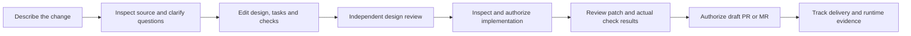

# Usable authoring and agent-assisted workflows

**Status: Proposed product and implementation plan, 2026-09-14.** No behavior in
this document is newly implemented or verified. This proposal responds to the
user's request to make the web and terminal usable and support Codex, Claude Code,
and AGY through their supported API and account-authentication paths. The user
confirmed the providers are Codex, Claude Code, and Google Antigravity; the latter's
CLI executable is `agy`.

The product outcome is that an engineer can describe a change, develop a design
with an assistant, review it, authorize implementation, and inspect and publish
the result without writing JSON or assembling opaque IDs. The existing
[full release target](../full-release.md) still applies, including cross-repository
work, both delivery providers, the selected tracker, and runtime evidence.

## Current assessment

The current interfaces expose storage and command contracts before helping the
user do the work. JSON remains useful for interoperability; requiring humans to
construct it is a product defect.

| Surface | What exists | Usability gap |
|---|---|---|
| Web review | Shared discovery, history, comparison, source inspection, exact approval | No package creation, revision, or submission editor; entry emphasizes a Change ID; complete package content is primarily JSON |
| Web agent work | Plan preview, authorization, receipts, complete artifact inspection | Creating a plan requires a JSON file or pasted plan; no assistant develops the proposal with the user |
| Web tracker/runtime | Inspectable records and consequential previews | Request authors still assemble JSON and related record references |
| Terminal | Package import/review plus separate authenticated release views | Creation opens a file-path prompt, content is JSON, and release navigation requires a different launch option |
| MCP | Agents can read context and create/revise/submit packages and propose runs | Native assistants can already help, but setup and complete-document commands leave too much assembly to the host |
| Internal coding adapters | Pinned Codex/Claude processes, bounded gateway, isolated patches and separate checks | They require approved work and execution authorization; they do not supply an authoring assistant before approval |

Evidence: [web review](../../apps/web/src/ReviewWorkbench.tsx),
[plan import](../../apps/web/src/CoordinatedRuns.tsx),
[tracker](../../apps/web/src/WorkTracking.tsx),
[runtime](../../apps/web/src/RuntimeEvidence.tsx),
[terminal rendering](../../internal/tui/view.go),
[MCP commands](../operations/mcp.md), and
[adapter qualification](../research/assistant-profiles.md).

The audit also rendered the current web app in Chromium with GET-only synthetic
session, repository, and empty-list responses. Review and Agent work screenshots
confirmed the empty-state dead end and blank Plan JSON field. This was a rendering
inspection, not live API, identity, database, or provider acceptance.

The package domain accepts an open content object; a giant document is not a
storage requirement. [Package summaries](../../internal/domain/changes.go)
currently lack a useful title/intent projection. Fixing discovery and authoring
does not require replacing immutable revisions or the execution engine.

## The primary journey

The web app becomes the primary authoring workspace. The terminal gains the same
core journey through the shared API, delivered alongside the corresponding web
increments. Both retain manual editing when an assistant is unavailable.

An example starts with: "Add rate limiting to login and make failures visible to
support." The engineer chooses the relevant repositories and an available
assistant, then develops one shared change through the following steps.

| Step | Human interaction | Conductor and assistant responsibility |
|---|---|---|
| Start | Enter a title and a plain-language goal, or select an existing linked ticket | Save a small draft and show the next useful action |
| Context | Select repositories, branch/commit, and proposed source scope | Resolve and display the immutable source selection, collect through existing authorization, and expose gaps |
| Clarify | Answer a few focused questions; leave undecided points explicit | Find relevant source, specs, Proposed/accepted source-recorded ADRs, and overlapping shared work; cite findings without inventing authority |
| Design | Edit sections and accept or reject individual suggestions | Propose behavior, scope, alternatives, tasks, acceptance criteria, and checks; preserve untouched content |
| Review | Read the rendered design and changes since the prior revision; submit or independently approve | Capture the inspected revision and digest; display unresolved questions and review requirements |
| Implement | Inspect affected paths, dependencies, profiles, checks, and available limits; authorize the plan | Assemble exact references from inspected records and use the existing coordinated executor |
| Verify and publish | Inspect the complete patch and actual results; authorize draft publication | Distinguish produced, failed, unexecuted, and verified evidence; use the trusted GitHub/GitLab publisher |
| Follow through | Inspect linked ticket, provider observations, and a selected deployment window | Retain tracker ownership, exact runtime criteria, and explicit unknown/stale states |

Design approval, implementation authorization, and publication remain separate
decisions. Each appears at the relevant step, with a concise explanation of its
effect. The interface computes request formats, IDs, digests, and idempotency keys
from captured facts. It never refreshes those facts inside a confirmation.

## Web and terminal design

The landing page should show **New change**, **Continue drafting**, **Needs your
review**, and existing work with titles, repository names, and a useful next action.
Do not imply assignment or live presence unless the service actually records it.
Show connection/setup problems with the missing capability and a concrete recovery
action. A normal author must not need to understand Temporal or prepare operator
configuration to discover why a feature is unavailable.

Opening a change shows its goal and next step first. Use readable sections for
intent, scope, design, open questions, tasks, and acceptance criteria. Offer source
references, revision comparisons, complete evidence, and advanced JSON inspection
without making these the initial empty screen. Preserve the explicit revision and
digest before approval; improve their explanation rather than weakening binding.

Provide a task-scoped assistant panel with actions such as **Clarify this goal**,
**Investigate affected code**, **Draft a design**, **Break into tasks**, **Propose
checks**, and **Explain this failure**. Conversation supports an editable work
artifact. Suggestions show their sources and section diff, and cannot silently
overwrite human edits or turn assumptions into decisions. A manual text editor is
always usable; assisted authoring must not become another mandatory prerequisite.

The terminal needs one navigation model, readable change titles, built-in section
editing, focused question prompts, a discoverable command/help menu, and explicit
action names. The same action should not alternate between saving a preview and
submitting a design. Keep JSON import/export as an advanced interchange path.
Render readable task summaries, complete patches, requirements and check results;
retain access-denial clearing, cancellation, and exact confirmation behavior.

Once a package is approved, **Prepare implementation** opens a builder populated
from that package, source, and available operator profiles. People edit the task
list, dependencies, writable paths and proposed checks. The service validates a
complete proposal. Unsupported checks stay missing/unverified; an assistant cannot
invent a compatible profile or report a proposed command as an executed check.

Delivery, tracker and runtime forms use inspected record pickers. A deployment
picker and UTC window controls replace runtime request JSON. Tracker linking uses
the one configured workspace tracker. Publication starts from the retained artifact
the person actually inspected. Existing uncertainty and retry behavior remains
visible in plain language.

## Provider and account connections

Keep three identities distinct: the person's Conductor account and permissions,
the provider account paying for model usage, and repository/tracker integrations.
Signing into a model provider must not grant Conductor approval or execution rights.

Support two coherent routes: an assistant inside Conductor using a qualified
provider connection, and the user's native assistant connected to Conductor's MCP
tools. Both work on the same shared drafts. A provider picker reports the actual
connection mode, available operations, tested version, and limits.

| Provider | Proposed API route | Proposed account route and qualification |
|---|---|---|
| Codex | Reuse qualified API-based adapter work where applicable; separately define a restricted authoring profile | Prototype the documented app-server managed ChatGPT browser/device login with per-user isolation. Prefer a trusted local stdio bridge initially; qualify protocol, recovery and sandbox compatibility before enabling it in shared operation |
| Claude Code | Use the supported Agent SDK/API path with customer-owned credentials for embedded assistance | Connect the user's unmodified, natively signed-in Claude Code through MCP. Hosted native-binary use is a separate qualification; Conductor must not implement its own Claude.ai token broker |
| AGY / Antigravity | Qualify a new local SDK or CLI adapter with Gemini API credentials or supported Google Cloud configuration | Connect native `agy` login plus MCP; qualify any embedded account flow independently rather than treating native OAuth as a reusable web grant |

Current OpenAI documentation describes app-server integration with authentication,
events and managed ChatGPT login. It also labels the app-server command and
WebSocket transport experimental and unsupported for production workloads. These
are candidates for an explicitly experimental connection, not proof that the
existing pinned worker supports subscription sessions. See
[app-server](https://learn.chatgpt.com/docs/app-server) and
[authentication](https://learn.chatgpt.com/docs/auth).

Anthropic documents native end-user sign-in to an unmodified Claude Code binary,
including hosted installations under its conditions. It separately disallows a
third-party Claude.ai login broker and directs embedded application developers
toward API credentials. Its current support update preserves personal SDK/print
usage within subscription limits. Keep those distinct; do not describe all
subscription automation as prohibited. Recheck the exact distribution and billing
model during qualification. See
[credential and product rules](https://code.claude.com/docs/en/legal-and-compliance),
[subscription SDK update](https://support.claude.com/en/articles/15036540-use-the-claude-agent-sdk-with-your-claude-plan),
and [SDK](https://code.claude.com/docs/en/agent-sdk/overview).

Antigravity now documents `agy`, native browser/SSH authentication, API-key mode,
headless operation, MCP, and a local Python SDK. Its managed cloud agent is a
different preview integration and is not needed for the initial local adapter.
Do not substitute Gemini CLI for AGY. See
[CLI authentication](https://antigravity.google/docs/cli/install/),
[headless operation](https://antigravity.google/docs/cli/headless/),
[MCP](https://antigravity.google/docs/mcp),
[SDK](https://antigravity.google/docs/sdk/overview), and
[managed agent](https://ai.google.dev/gemini-api/docs/antigravity-agent).

Every new adapter/authentication mode needs an inspected, immutable CLI/SDK/image
pin and real account acceptance before being advertised as working. Existing
Codex/Claude help and controlled-protocol tests do not prove successful paid model
inference. A saved connection, successful login, successful model request, and
successful isolated coding run are separate capability facts.

The connection UI should support native sign-in where documented, protected API
credential configuration where permitted, explicit connection testing, account
expiry, disconnect, and quota/rate-limit recovery. Show whether usage is billed to
the selected API account or native subscription. Request/token/time controls can be
enforced; do not promise an exact currency cap without provider support. No paid
provider calls are part of producing this plan.

## Service and authority design

Add bounded authoring assistance before coding. The existing executor cannot draft
its own prerequisite approval. Assistance initially reads authorized retained
source and produces questions or document suggestions; it does not run repository
commands or write patches. Actual Spec Kit/ADRKit command execution continues to
use the authorized design-tool path; drafted ADR prose remains Proposed.

Use existing package revisions for explicit document saves. Add shared editing
drafts only for unfinished work, with their own optimistic version and atomic
save/apply command. Draft autosave must be recoverable across sessions without
rewriting approved package content or generating a revision on every keystroke.
Applying a draft creates a normal unapproved package revision. Define conservative
legacy-field mappings, preserve unknown extensions and omitted fields, and leave
every existing digest unchanged. Add bounded section edits on the server so a
client or assistant cannot accidentally drop the remainder of a large document.

A retained assistance request binds its draft/package version, requested operation,
selected source tuples, provider/profile, request key, and finite bounds. Its
result contains answerable questions, proposed section changes, citations, known
gaps, and provider provenance. The service validates citations against the exact
authorized retained source tuples and quoted content; model-supplied IDs or text
alone cannot establish trusted provenance. Suggestions are proposals; a separate captured,
version-checked author command applies the selected result. Concurrent edits yield
a reviewable conflict. Regeneration is an explicit new request, not a hidden
retry that may incur more model usage.

Record requester, provider/agent contribution, and applying editor separately.
Applying an assistant's draft must not allow its requesting human to become an
independent approver by attributing the entire revision to an agent. The exact
contribution/independence policy requires a Proposed ADR and human architectural
review before implementation; use a conservative exclusion in the proposed model.

PostgreSQL owns drafts, suggestions, questions, connection metadata, revision and
audit facts. Temporal owns durable assistance sequencing and recovery, using the
existing inbox/outbox and reconciliation principles. Activities load source,
prompts and credentials outside workflow history. Store only bounded opaque
references and safe observations in history/events; stream authorized progress to
clients through the service, with explicit observation age and disconnect state.
Source-bearing content remains scoped in protected storage rather than logs.

Provider enablement, who may request assistance, per-account use and spend policy
are proposed operator-owned controls. A connection never implicitly widens author
or source access. Recheck all included repositories at retrieval and result commit;
protect drafts, conversations and derived suggestions with their complete source
access requirements. Native client configuration must disclose which source goes
to its provider. Neither native MCP nor SDK tools expose human approvals.

For each provider invocation, admit an immutable bounded attempt before external
work. Recover a committed result on redelivery. Lost provider acknowledgments
remain uncertain until supported reconciliation resolves them. If the provider has
no reconciliation capability, retain an unresolved attempt and allow explicitly
requested new generation after renewed inspection and confirmed stopping where
tools may still be active; disclose that the earlier request may have incurred
usage. An expired native login requires reconnection, with the interrupted attempt's
outcome reported separately. Provider session IDs are correlation references,
not a second execution authority. Native connection
loss cannot silently switch accounts, upgrade permissions, or start another run.
Maintain the existing credential separation for every coding profile; account
login must not place long-lived credentials into repository-controlled commands.

The current MCP bridge is fixed-scope stdio with a Conductor token file. A guided
connection checker and native-client setup can build on it. Browser provider login
does not implement Conductor API login; a future interactive Conductor CLI login
would need its own authentication specification and qualification.

## Incremental delivery and review order

Each row is an independently reviewable increment, with a complete demonstrable
outcome. The dependency column is the proposed stacked PR order, not an existing
branch or PR. Split a row further if required, preserving immediate prerequisites.
This sequence does not authorize merging, deployment, paid account use, or accepting
ADRs. Provider research and UI prototypes can proceed in parallel.

| Increment | Depends on | User-visible outcome and completion evidence |
|---|---|---|
| 1. Start and review a change | Current main | Web and TUI title/intent entry, small section editor, meaningful list, submit and independent review; a new user completes the manual review loop without JSON, a file import, or an ID lookup |
| 2. Build context through selections | 1 | Repository/ref/path and retained-receipt selection, proposed relevant scope, source gaps, and context attachment; use bounded provider read activities for any new ref/tree discovery; demonstrate GitHub and GitLab plus related-source denial |
| 3. Shared drafts and native assistance | 2 | Versioned drafts/suggestions, section operations, recoverable questions and native MCP setup for one qualified host; user requests a draft there and reviews it in either UI without copying JSON; remaining hosts proceed in parallel |
| 4. Assistance inside Conductor | 3 | API-based assistance plus an explicitly experimental Codex managed-login prototype; bounded worker, questions, source-backed suggestions, progress, cancellation, conflict and reconnect; prove one real provider journey before calling it working |
| 5. Readable execution and delivery | 4 | Prepare task DAG/checks from inspected work, authorize execution, read complete diffs/results, authorize GitHub/GitLab draft publication without request JSON; preserve cross-repository claims and uncertain recovery |
| 6. Tracker and runtime | 5 | Record/deployment pickers replace remaining request JSON; full web/TUI journey and both tracker variants; actual UI, persistence and recovery evidence |
| 7. Provider breadth and complete acceptance | 6 as review base | Qualify embedded API assistance for Codex, Claude and AGY, and each offered native account mode; test expired login, provider errors, limits and credential isolation; finish complete workflow acceptance |

Provider qualification work for increment 7 can begin after the assistance boundary
in increment 4, independently of increments 5–6. Its review base keeps the published
stack ordered; completing every provider is not a prerequisite to making execution,
delivery, tracker or runtime usable with the first working assistant.

The first useful milestone is increments 1–4: an engineer describes a change,
develops it with one working assistant, saves it, and an independent reviewer can
understand and approve it. The full usability target includes increments 5–7;
the first milestone is not a substitute for the coordinated platform.

For each implementation increment, update applicable feature specs/plans, service
and OpenAPI contracts, clients, architecture, runbooks and implementation status.
New endpoints and packages should accompany working functionality, not empty
scaffolding. Keep adapter versions and native-host support explicit.

## Acceptance and unresolved decisions

Use task completion as the usability gate, alongside existing safety tests:

1. On a configured workspace, a first-time engineer starts from an empty screen,
   describes a synthetic change, and reaches a useful editable draft without
   consulting repository docs or an API schema. A manual draft takes no provider.
2. An assisted journey asks focused questions, cites actual retained source, and
   leaves unknowns visible. A user can reject a suggestion or edit one section
   without losing other content, including unknown legacy fields.
3. Another authorized client resumes the shared draft and questions. Account,
   workspace, and source denial clear private state and prevent late responses
   from restoring it. Provider conversation memory is not required for recovery.
4. A reviewer can explain the goal, affected scope, open questions and planned
   checks from the rendered document, then approve only the inspected revision.
   A concurrent edit rejects stale application, submission, or approval.
5. A user reaches authorized implementation, actual separate verification and
   draft publication using selections and plain-language inputs. No core flow
   requires manual JSON, request files, digest transcription or opaque-ID copying.
6. Keyboard-only browser and real PTY acceptance exercise the same journey;
   capture desktop and narrow-screen screenshots, and record validation from at
   least one person unfamiliar with Conductor. Proposed usability target: a
   manually saved first draft within five minutes in an already configured workspace.
7. Lost responses preserve the exact request and recovery path. Worker restart,
   provider session expiry and partial streams never appear as successful work or
   trigger uninspected duplicate generation/publication. Retain the existing real
   PostgreSQL, Temporal, Docker, source-denial and artifact-integrity assertions.
8. Mark every provider/authentication mode as documented, implemented,
   fixture-verified, or live-qualified based on evidence. A synthetic assistant
   or mock login does not pass the real assistant milestone.

Recommended starting choices are web-first design with the core TUI journey in
each increment, API assistance for shared service operation, and native account
connections for subscription users. Provider-specific OAuth embedding remains
subject to the documented protocol and qualification limits above. Before coding
the new assistance boundary, resolve credential ownership, authoring-use limits,
contribution attribution and deployment topology in a Proposed ADR. The user can
change those product choices without abandoning the no-manual-JSON outcome.
