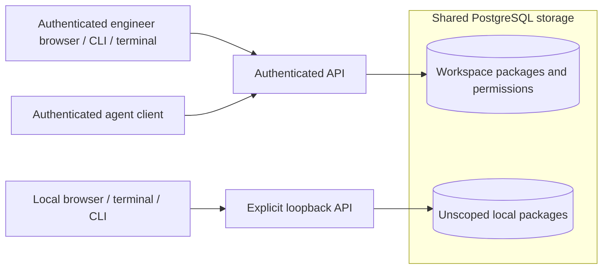

# Shared engineering context

**Status:** Shared storage, authenticated workspace and repository access, and
review through the browser, API, CLI, and interactive terminal are implemented.
Explicit local development mode remains separate from workspace data.

## One shared record

Conductor stores package revisions, approvals, and audit events in PostgreSQL.
These records belong to the service, rather than a browser tab, a developer's
machine, or a model conversation. People and agent clients with access to the same
workspace and repository see the same durable facts through the API.

An engineer can discover another engineer's package, inspect its pinned repository
context, and recover prior revisions and approvals. Discovery applies repository
permissions before pagination; knowing a package ID does not bypass access checks.
Historical content and audit events have the same access boundary as the current
package. Revision and digest checks remain mandatory for every consequential edit
or approval.

Both modes use the same review commands and storage model. Their data scopes are
separate even in one database: local actor headers cannot inspect workspace
packages, and authenticated requests cannot inspect unscoped local packages.
Migration preserves existing content, digests, approvals, and attribution without
assigning those packages a workspace implicitly.

This is shared saved work, not real-time presence or an execution scheduler. The
revision author and audit events identify recorded contributions; they do not
prove who is currently editing or running an agent. Changes become visible on an
explicit reload. Live notifications, assignments, execution attempts, work claims,
and overlapping-path detection remain future additions.

## Identity and authority

The server verifies a configured issuer's signed access token, then resolves its
issuer/subject pair to an active PostgreSQL principal. Workspace membership and
repository capabilities are provisioned by a trusted database operator. Token role
claims, client actor fields, and human perspective selectors cannot grant rights.
The operator's audit label records context; it is not an authentication mechanism.

A principal has an immutable human or agent kind. Agents may receive permission to
read, author, and submit work. Approval always requires a human principal with the
repository's approval capability, independently of the revision author. Even an
incorrect approval grant cannot allow an agent to approve. Design approval remains
bound to the exact inspected revision and digest.

Permission checks for commands share the transaction that commits their review
facts and audit events. Revoking a principal, membership, or capability takes effect
for subsequent commands; an operator cannot change a checked permission between
that command's authorization and commit. Access configuration updates are also
audited transactionally. Disabling access preserves the earlier attribution.

OIDC mode supports the documented RFC 9068 RS256 access-token profile, not arbitrary
provider JWTs, ID tokens, or opaque tokens. Tests exercise a synthetic issuer;
compatibility with a particular identity vendor has not been established. The CLI
and terminal read a selected token file without interactive identity-provider login.
The browser separately uses authorization code flow with PKCE and protected
PostgreSQL sessions; its ID tokens never become API bearer credentials. Session and
scope changes clear the workbench inspection. See the
[browser guide](../operations/browser-sign-in.md),
[authenticated review guide](../operations/authenticated-review.md), and
[Feature 003](../../specs/003-workspace-access/spec.md).

The [terminal workbench](../operations/terminal-review.md) fixes its credential,
workspace, and repository for one session. It discovers the server principal and
effective capabilities before showing shared work. Authentication or permission
failure clears inspection, capabilities, and imported drafts. Explicit reload
rechecks access before inspecting again; approval itself never reloads identity or
content. Switching credentials or scope requires starting a new terminal session.

## Canonical repositories and context

Managed repository identity includes GitHub or GitLab, normalized host, and stable
provider repository ID within a workspace. Names are display metadata. Package
workspace/repository ownership cannot change when content is revised. An optional
selected repository narrows discovery, inspection, history, and mutations.
Registration is operator configuration; it does not prove remote provider access
or implement publication. See the [provider plan](repository-providers.md).

The snapshot's author-supplied repository string is still a grouping label and an
optional exact filter. Editing it cannot change ownership or permissions. Pinned
source remains evidence supplied by its author, not independently verified remote
provenance or proof of passed checks.

Before planning or executing work, a future agent adapter should retrieve related
packages for the canonical repository, inspect the relevant approved revision and
source baseline, and disclose unresolved overlaps. Findings and generated summaries
remain evidence; they do not grant approval or replace a human decision.

Spec Kit and ADRKit artifacts are shared through pinned package snapshots. Their
text, file identity, commit, and digest remain recoverable. Native tool integrations
must later define which artifacts they own and how updates create new revisions.
An imported decision's status cannot authorize Conductor execution implicitly.

## Later integrations

Execution and publication remain disabled. Future workers do not receive human
publication credentials merely because they can read the same package.

Each workspace will select one work tracker, Linear or Jira. A ticket can then link
related packages and changes across multiple GitHub/GitLab repositories. The tracker
will own configured planning fields; Conductor owns revisions, approvals, and
evidence. Tracker configuration and synchronization remain planned; see
[work tracking](work-tracking.md).
