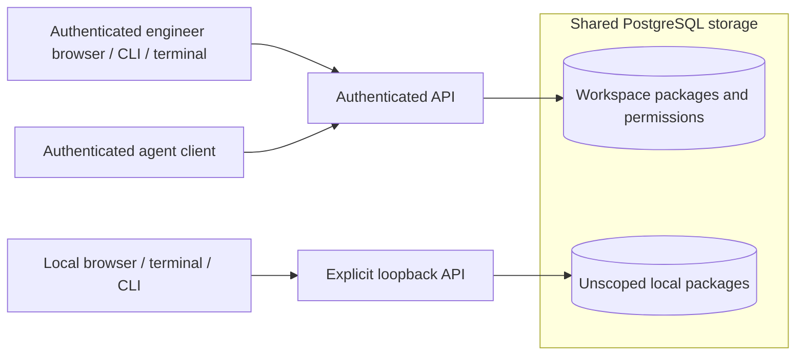

# Shared engineering context

**Status:** Shared storage, authenticated workspace and repository access, and
review through the browser, API, CLI, and interactive terminal are implemented.
Explicit local development mode remains separate from workspace data.
The opt-in durable context increment adds shared requests and receipts through
the API, CLI, browser and authenticated terminal. Its bounded provider reads are
tested with controlled fixtures; live provider compatibility and production
operation remain unverified.

## One shared record

Conductor stores package revisions, approvals, and audit events in PostgreSQL.
These records belong to the service, rather than a browser tab, a developer's
machine, or a model conversation. People and agent clients with access to the same
workspace and repository see the same durable facts through the API.

An engineer can discover another engineer's package, inspect its pinned repository
context, and recover prior revisions and approvals. Discovery applies repository
permissions before pagination; knowing a package ID does not bypass access checks.
Historical content and audit events have the same access boundary as the current
package. Revision and digest checks remain mandatory for every consequential edit
or approval.

Both modes use the same review commands and storage model. Their data scopes are
separate even in one database: local actor headers cannot inspect workspace
packages, and authenticated requests cannot inspect unscoped local packages.
Migration preserves existing content, digests, approvals, and attribution without
assigning those packages a workspace implicitly.

The revision author and audit events identify recorded contributions; they do not
prove who is currently editing or running an agent. Changes become visible on an
explicit reload. Live notifications, assignments, coding-agent execution attempts,
work claims, and overlapping-path detection remain future additions. The context
workflow below records only its own bounded remote collection activity.

## Identity and authority

The server verifies a configured issuer's signed access token, then resolves its
issuer/subject pair to an active PostgreSQL principal. Workspace membership and
repository capabilities are provisioned by a trusted database operator. Token role
claims, client actor fields, and human perspective selectors cannot grant rights.
The operator's audit label records context; it is not an authentication mechanism.

A principal has an immutable human or agent kind. Agents may receive permission to
read, author, and submit work. Approval always requires a human principal with the
repository's approval capability, independently of the revision author. Even an
incorrect approval grant cannot allow an agent to approve. Design approval remains
bound to the exact inspected revision and digest.

Permission checks for commands share the transaction that commits their review
facts and audit events. Revoking a principal, membership, or capability takes effect
for subsequent commands; an operator cannot change a checked permission between
that command's authorization and commit. Access configuration updates are also
audited transactionally. Disabling access preserves the earlier attribution.

OIDC mode supports the documented RFC 9068 RS256 access-token profile, not arbitrary
provider JWTs, ID tokens, or opaque tokens. Tests exercise a synthetic issuer;
compatibility with a particular identity vendor has not been established. The CLI
and terminal read a selected token file without interactive identity-provider login.
The browser separately uses authorization code flow with PKCE and protected
PostgreSQL sessions; its ID tokens never become API bearer credentials. Session and
scope changes clear the workbench inspection. See the
[browser guide](../operations/browser-sign-in.md),
[authenticated review guide](../operations/authenticated-review.md), and
[Feature 003](../../specs/003-workspace-access/spec.md).

The [terminal workbench](../operations/terminal-review.md) fixes its credential,
workspace, and repository for one session. It discovers the server principal and
effective capabilities before showing shared work. Authentication or permission
failure clears inspection, capabilities, and imported drafts. Explicit reload
rechecks access before inspecting again; approval itself never reloads identity or
content. Switching credentials or scope requires starting a new terminal session.

## Canonical repositories and context

Managed repository identity includes GitHub or GitLab, normalized host, and stable
provider repository ID within a workspace. Names are display metadata. Package
workspace/repository ownership cannot change when content is revised. An optional
selected repository narrows discovery, inspection, history, and mutations.
Registration is operator configuration; it does not prove remote provider access
or implement publication. See the [provider plan](repository-providers.md).

The snapshot's author-supplied repository string is still a grouping label and an
optional exact filter. Editing it cannot change ownership or permissions. Version 1
local snapshots remain author-supplied evidence; their digests and unknown extension
fields retain their original meaning. Version 2 snapshots link to a server-stored
receipt only after the service resolves and compares the entire snapshot under its
canonical scope. Neither version establishes a passing check or accepted decision.

Before planning or executing work, a future agent adapter should retrieve related
packages for the canonical repository, inspect the relevant approved revision and
source baseline, and disclose unresolved overlaps. Findings and generated summaries
remain evidence; they do not grant approval or replace a human decision.

Spec Kit and ADRKit artifacts are shared through pinned package snapshots. Their
text, file identity, commit, and digest remain recoverable. The implemented
[native design tools](../operations/design-tools.md) create exclusive new core
templates and Proposed ADRs, and retain native checks inside exact execution
artifacts. Changed source enters a new package/context revision through existing
commands.
An imported decision's status cannot authorize Conductor execution implicitly.

## Shared remote collection

An authenticated human or agent with author permission may request explicit paths
at a full commit ID only when the server and repository integration are enabled.
Every collection command requires a selected workspace and canonical
repository. Requests use requester-scoped idempotency keys. Readers with repository
access can discover the shared requests and inspect receipts; they do not need the
requester's session or provider credentials. Permission checks filter listings
before pagination and also protect direct reads and mutations.

PostgreSQL commits request intent and an outbox event together. Temporal sequences
the bounded provider activity; the database owns the immutable receipt and audit
facts. Workers recheck authority before provider operations and receipt publication.
Provider credentials and source text stay outside workflow history. A missing path,
an unavailable read, or truncated coverage remains visible in the receipt.

Attachment is an explicit version-checked command using the inspected package
revision, collection ID, and receipt digest. It appends the stored snapshot without
fetching again, preserves unrelated content, and leaves earlier approval historical.
Approval never collects or attaches source. A JSON receipt ID cannot bypass these
scope and integrity checks, including through generic create or revise commands.

Cancellation records intent from the authorized requester. A timestamped execution
observation separately reports whether the workflow stopped; stale, unavailable,
and unresolved observations are not current runtime proof. An immutable receipt
can remain available when runtime progress cannot be determined.

The browser, authenticated terminal, API and CLI expose the same stored collection
records. Reader access permits inspection without author controls; cancellation
also requires the current requester. Browser version 2 rendering compares the full
snapshot with an explicitly inspected scoped receipt before reporting a match.
Both interfaces retain complete JSON and render source as escaped text. Neither
refreshes a package or receipt inside an attachment confirmation. They retain
uncertainty after a lost response and clear inspection on access failure. See the
[durable context guide](../operations/durable-context.md) for the local Temporal
deployment profile, provider limits, and recovery procedures.

## Coordinated work and linked systems

Coding-agent execution and repository publication now use separate exact human
authorizations. Shared task plans bind every package, graph, source receipt,
execution profile and image. Path claims expose overlapping work across engineers
and agents; receipts and cleanup facts preserve recoverable context after a session
ends. All-source grants protect graph, task-artifact, delivery and runtime reads.

Each workspace selects one work tracker, Linear or Jira. Tickets link exact package
revisions and immutable publication receipts across repositories. The tracker owns
planning fields; Conductor owns approvals, evidence and its link projection.
Synchronization conflicts require an explicit authorized human resolution, and a
tracker status cannot approve work or establish a successful delivery. See
[work tracking](work-tracking.md) and [coordinated execution](coordinated-execution.md).

Runtime evidence similarly retains an exact delivery observation, deployment,
commit, environment and time window. Only source-bound approved criteria can be
evaluated; stale or incomplete evidence remains distinct from historical results
and does not prove current application health. These records are shared service
facts, never private agent memory. See [runtime evidence](../operations/runtime-evidence.md).
