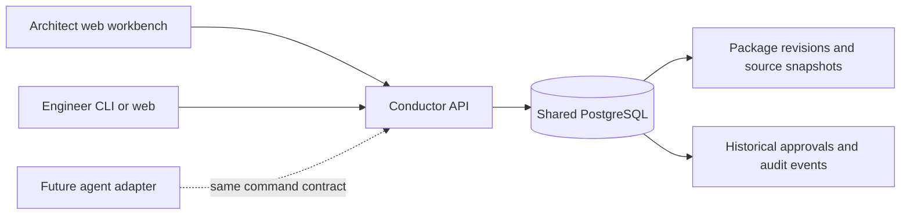

# Shared engineering context

**Status:** Shared package storage and discovery are implemented in the local
development API. Authenticated workspaces and repository permissions are planned.

## One shared record

Conductor stores package revisions, approvals, and audit events in PostgreSQL.
Web, CLI, and future agent adapters read and write through the same API. These
records belong to the shared service, rather than a browser tab, a developer's
machine, or a model conversation. Two clients using the same API see the same
durable facts.

The shared change browser lists current package revisions and supports exact
repository-identity filtering. An engineer can find another engineer's package,
inspect the pinned repository context, read prior revisions and approvals, and
compare changes. An agent can obtain the same information through the API/Go
client. Revision and digest checks remain mandatory when either client mutates
state.

This is shared saved work, not real-time presence or an execution scheduler. The
revision author and audit events identify recorded contributions; they do not
prove who is currently editing or running an agent. Changes become visible on an
explicit reload. Live notifications, assignments, execution attempts, work claims,
and overlapping-path detection remain future additions.

## Context across people and agents

Before planning or executing work, a future agent adapter should retrieve related
packages for the canonical repository, inspect the relevant approved revision and
its source baseline, and disclose unresolved overlaps. Agent findings and generated
summaries remain evidence. They do not grant approval, establish ownership, or
replace a human decision.

Spec Kit and ADRKit artifacts are shared through pinned package snapshots in this
increment. Their text, file identity, commit, and digest remain recoverable. Native
tool integrations must later define which artifacts they own and how updates create
new package revisions. An imported decision's status cannot authorize Conductor
execution implicitly.

## Required before shared deployment

The current local actor header is not authentication. Shared deployment needs a
server-verified identity, workspace membership, canonical repositories, and
repository-aware permissions for discovery, inspection, and mutation. Filtering a
change list by an author-supplied repository label is not authorization.

Human perspective settings organize the interface. Server-owned capabilities must
determine who can author, review, inspect evidence, or authorize a future action.
Agent service identities need their own attributable scopes. A user should never
gain rights by choosing “architect,” and an agent must not inherit a human's
publication credentials just because it can read the same package.

The next authentication increment must test isolation between workspaces and
repositories as well as collaboration within them. Execution and publication must
remain disabled until those boundaries and durable recovery are verified.

Managed repositories may use GitHub or GitLab. Canonical identity must include
provider and host as well as the provider's repository ID, so similarly named
repositories cannot share permissions or context accidentally. Both providers
follow the same collaboration rules; see the [provider plan](repository-providers.md).
