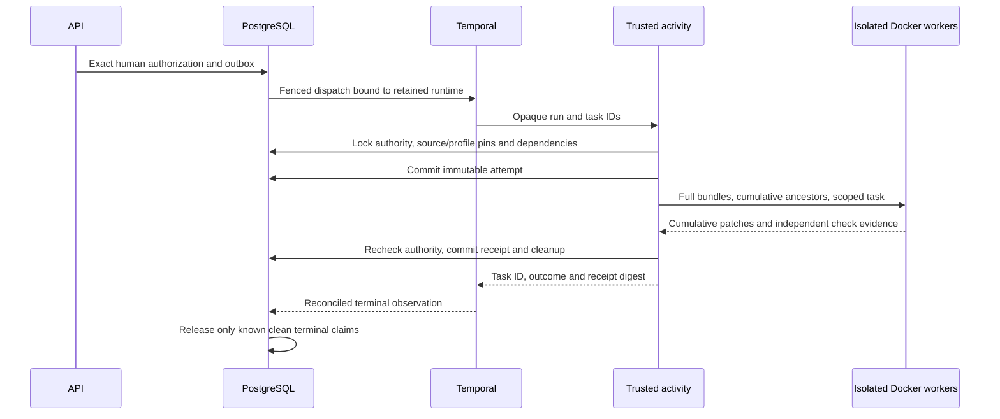

# Shared coordinated execution

**Current:** immutable plans, human authorization, durable dispatch, isolated
producers, dependent artifacts and independent checks. Client workbenches and
publication are tracked separately.

PostgreSQL owns plans, human authorizations, write claims, immutable task receipts
and audit facts. Temporal owns task sequencing, activity delivery and cancellation.
The API writes an outbox intent atomically with authorization. A trusted dispatcher
binds that intent to a checked Temporal cluster/namespace and unique workflow.
A database observation is timestamped evidence of that workflow, never its scheduler.

Plan admission holds principal and workspace membership locks, repository grants,
separate human execution grants, and package revision advisory locks until commit.
Sorted repository admission locks prevent two plans from claiming the same path.
No approval action acquires new source or substitutes newer content.

The isolated producer consumes a retained complete Git bundle and verified
predecessor patches. Its write allowance applies to the change from that prepared
baseline; the retained cumulative patch applies to the original approved commit.
Verification runs in a separate container. Publication uses a separate trusted
service and credential catalog after an exact-artifact human authorization.

Every operation rechecks all repositories in a cross-repository run. Read summaries
are compact and paginated; detailed plans retain prompts and exact source bindings.
Perspective labels are descriptive and never affect these permission checks.

See the [specification](../../specs/009-coordinated-execution/spec.md),
[runbook](../operations/coordinated-execution.md), and
[worker boundary](../operations/coding-workers.md).

An immutable attempt binds the complete worker input, reviewed profile/image and
bounded deadline before the first producer starts. Repeated activity delivery
first recovers a committed receipt. An existing attempt without a receipt cannot
start again: after its database-measured deadline, recovery removes its exact
Docker resources and records an unresolved outcome. That doubt remains visible.

The workflow boundary retains trusted transient-failure classifications while
discarding their underlying error text. Its bounded retry policy can recover a
committed receipt after an acknowledgment is lost. It cannot make permission
denials, changed bindings, cancellation or arbitrary errors retryable, and retries
never bypass the immutable-attempt check or use another run/task reference.

A running activity rechecks all repository grants, approved revisions and public
profiles each second, cancelling production if authority cannot be confirmed.
A final transaction rechecks them before accepting source-bearing artifacts.
Cancellation or revocation discards those artifacts and retains only stopped and
cleanup facts. A previously committed receipt survives later revocation for trusted
retry reconciliation; public inspection still requires current access.

Write claims are released only after observed terminal Temporal execution, one
non-unresolved receipt for every task, and confirmed cleanup for every admitted
attempt. A completed receipt alone cannot prove that an unknown workflow stopped.
Runtime-target changes, missing retained history and lost producer results preserve
reservations. Operators must inspect unresolved work; recovery never silently
replaces it or grants publication authority.

Source, prompts, argv, provider keys and patch payloads remain outside Temporal
history. PostgreSQL contains immutable artifacts; Docker gets no publication,
production or Conductor API credentials. The model proxy described in the worker
runbook is the only network route available to native assistant producers.
