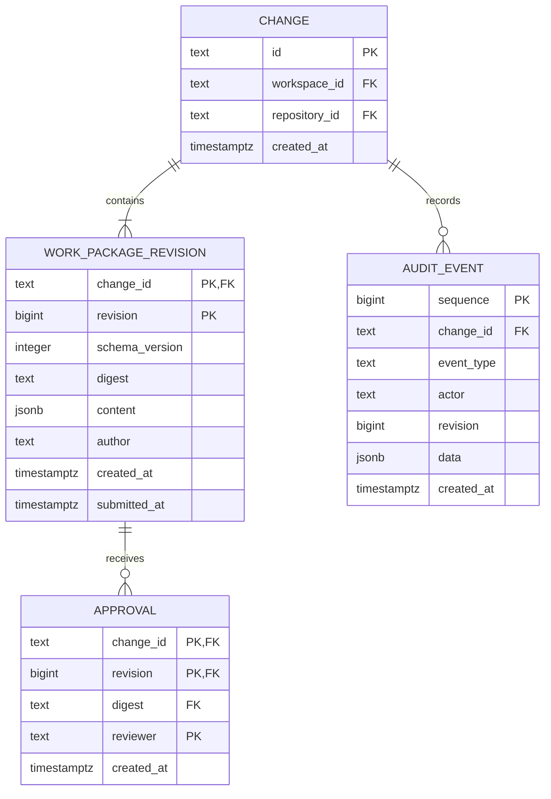
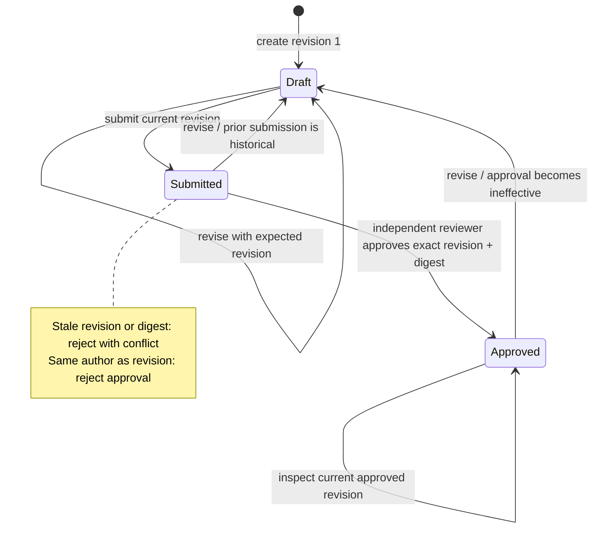
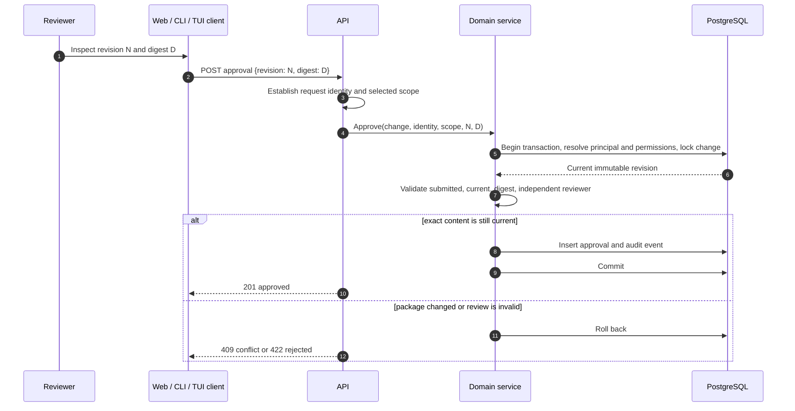
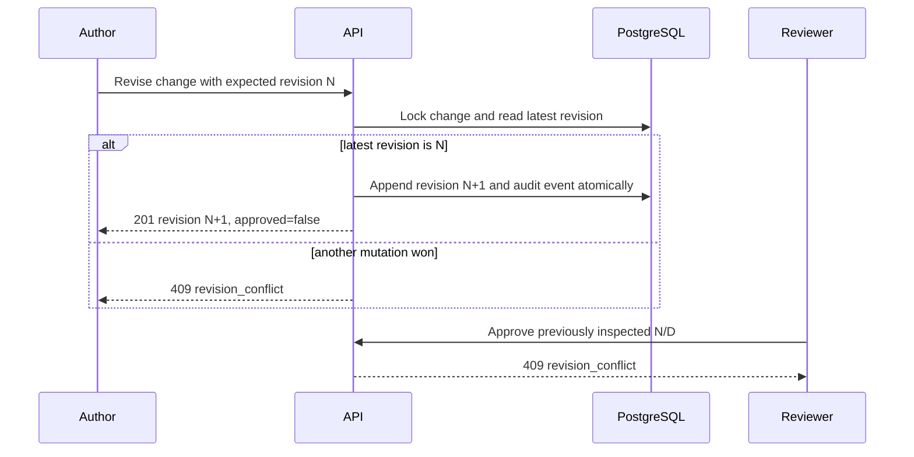

# Milestone 1: durable work-package review

## Scope and status

The original Milestone 1 review slice supports creating an immutable package revision,
submitting the current revision, inspecting it, approving its exact revision and
digest, and appending a revision that makes the prior approval ineffective.

The Go CLI, Bubble Tea terminal workbench, HTTP API, domain service, PostgreSQL
schema/store, and React inspector implement the local review workflow, with
committed dependency locks. Live PostgreSQL tests cover concurrent edits,
transactional audit rollback, missing packages, and connection-pool reopen.
An opt-in acceptance suite separately restarts the actual API and PostgreSQL
processes and verifies preserved content, approvals, history, audit, and discovery.
Real PTY acceptance exercises the terminal through that same API/store path.
[Feature 003](../../specs/003-workspace-access/spec.md) adds authenticated workspace
and repository review through the API and noninteractive CLI.
[Feature 004](../../specs/004-browser-sign-in/spec.md) adds browser OIDC sign-in and
shared review. [Feature 005](../../specs/005-authenticated-terminal/spec.md) adds
authenticated terminal review with a fixed credential and scope, server-provided
capabilities, and explicit recovery after access failure.

[Feature 019](../../specs/019-guided-change-authoring/spec.md) adds readable browser
and terminal authoring on those same commands. The interface calls the existing
work package a **Change** and its reviewable content a **Design**. Guided text fields
preserve unknown or nonstring structured content and leave untouched missing keys
absent. Saving a draft and requesting review are separate actions. Shared discovery
projects optional title and intent strings from the latest authorized revision,
bounded to 200 and 400 Unicode code points with explicit truncation flags. The
projection does not alter revision serialization, digests or pagination authority.

[Feature 006](../../specs/006-durable-context/spec.md) adds an opt-in remote context
collection workflow to the API, CLI, browser and authenticated terminal. Its
implementation includes scoped requests, PostgreSQL outbox delivery, a trusted
Temporal worker, bounded GitHub/GitLab reads, immutable receipts, and explicit
attachment as a new package revision. Targeted
tests cover the permission and receipt boundaries; controlled provider fixtures
do not establish live provider compatibility or production readiness. See the
[context architecture](durable-context.md) and [runbook](../operations/durable-context.md)
for deployment limits and separate runtime acceptance.

## Domain model

A work package is the latest immutable revision plus an **effective** approval, if
one exists for the same `(change_id, revision, digest)`. Historical approval rows
are retained; the application never flips a freely writable `approved` column.
Feature 003 adds immutable workspace/repository ownership outside revision content.
Legacy local packages retain null ownership; migrating them does not change content,
digests, authors, or approval records. The [shared context model](collaboration.md)
describes permissions and the separation between local and authenticated data.

## Review lifecycle

`Approved` is derived, not assigned. Appending a revision transitions the current
view to `Draft` while leaving all historical evidence intact.

## Exact-revision approval sequence

The client must send what was displayed. It must not fetch a newer revision inside
an approval action. A `409` requires the reviewer to inspect the new revision.

## Edit and invalidation sequence

PostgreSQL advisory transaction locks serialize commands for one change. Optimistic
revision checks still define client-visible concurrency semantics. Commands for
unrelated changes remain independent.

## Command and endpoint map

| Intent | CLI | HTTP | Required concurrency input |
|---|---|---|---|
| Create | `conductor create` | `POST /api/v1/changes` | None |
| Inspect | `conductor show` | `GET /api/v1/changes/{id}` | None |
| Revise | `conductor revise` | `POST /api/v1/changes/{id}/revisions` | Expected revision |
| Submit | `conductor submit` | `POST /api/v1/changes/{id}/review-requests` | Inspected revision |
| Approve | `conductor approve` | `POST /api/v1/changes/{id}/approvals` | Inspected revision and digest |
| Attach collected context | `conductor context-attach` | `POST /api/v1/changes/{id}/context-attachments` | Inspected package revision, collection ID, and receipt digest |

The exact payload contract is maintained in `api/openapi.yaml`.
The [terminal workbench](../operations/terminal-review.md) invokes the shared Go
review commands with the revision displayed before confirmation. Conflicts and
uncertain mutation outcomes block further writes until explicit inspection.

## Invariants

1. Revision numbers increase monotonically within a change.
2. Revision content is append-only and recoverable.
3. Digest is SHA-256 of Go's deterministic JSON encoding of the structured content.
4. Revision and audit event are committed in one transaction.
5. Only the current submitted revision can be approved.
6. A revision author cannot approve that revision.
7. Approval identity comes from the request context, never the approval payload.
8. An approval is effective only for its referenced current revision and digest.
9. Unknown content fields survive because content is stored as structured JSON.
10. Missing evidence or unavailable integrations cannot be represented as passing.
11. Authenticated ownership is immutable; content labels do not change access.
12. Agent principals cannot approve, even with a configured approval grant.
13. Permission checks and consequential review writes share one transaction.
14. Remote context attachment resolves an immutable receipt under the same canonical
    workspace/repository and creates a new draft revision. It never refreshes source
    or carries an approval forward.
15. Version 1 context snapshots keep their original content and digest, including
    unknown extensions. Version 2 trusted linkage requires the complete stored
    snapshot; a client-supplied receipt ID alone establishes no provenance.

## Review boundaries and later features

This section retains Milestone 1's review scope. Later feature links describe the
current release without making package approval an execution or delivery command.

- Local actor headers are development identity only and cannot access workspace
  packages. The terminal supports this explicit loopback mode as well as authenticated
  workspace review.
- Authenticated API/CLI access supports the documented signed access-token profile.
  Synthetic issuer tests do not establish compatibility with a real identity vendor;
  browser login uses separately validated ID tokens and protected server sessions.
  Later [Keycloak qualification](../operations/keycloak-qualification.md) tests one
  native browser-login profile without broadening the strict API token contract.
  The CLI and terminal do not acquire or refresh API access tokens.
- Remote context collection requires OIDC mode, explicit server enablement, an
  operator-enabled repository integration, and author permission. Temporal now
  supports explicit local or [verified TLS/mTLS transport](temporal-tls.md).
  [Coordinated coding](../../specs/009-coordinated-execution/plan.md),
  [GitHub/GitLab publication](../../specs/011-repository-delivery/plan.md) and
  [Linear/Jira synchronization](../../specs/012-work-tracking/plan.md) are implemented
  as separate features with their own permissions and documented fixture limits.
  Local Git collection remains available through Feature 002.
- Collection controls use the same scoped commands in the browser, terminal,
  API and CLI. The web inspector renders version 2 coverage and checks full receipt
  linkage explicitly; the terminal shows escaped source and complete JSON.
  Confirmation captures the inspected package revision and receipt identity.
- Shared discovery, historical revision inspection, and audit-query endpoints are
  available; see [Feature 002](../../specs/002-context-history/spec.md).
- Process-restart acceptance proves persistence across completed commands and
  process restarts. It does not prove power-loss durability, high availability,
  point-in-time recovery, or remote workflow recovery. Feature 006 has separate
  opt-in Temporal recovery checks with owned temporary resources.
- The schema currently rejects duplicate content within a change; unchanged edits
  and exact content reverts need an explicit domain policy and error contract.
- The terminal workbench supports current-package review. Historical inspection
  remains available in the CLI and web; revision comparison is available in the web.

## Native assistance follow-through

[Native Design assistance](native-design-assistance.md) adds immutable help requests
and agent section suggestions outside the saved Design. A requesting human applies
selected strings through the shared service as a new revision, preserving unknown
content and the existing independent review rule. PostgreSQL owns these facts; no
model execution scheduler is introduced.
