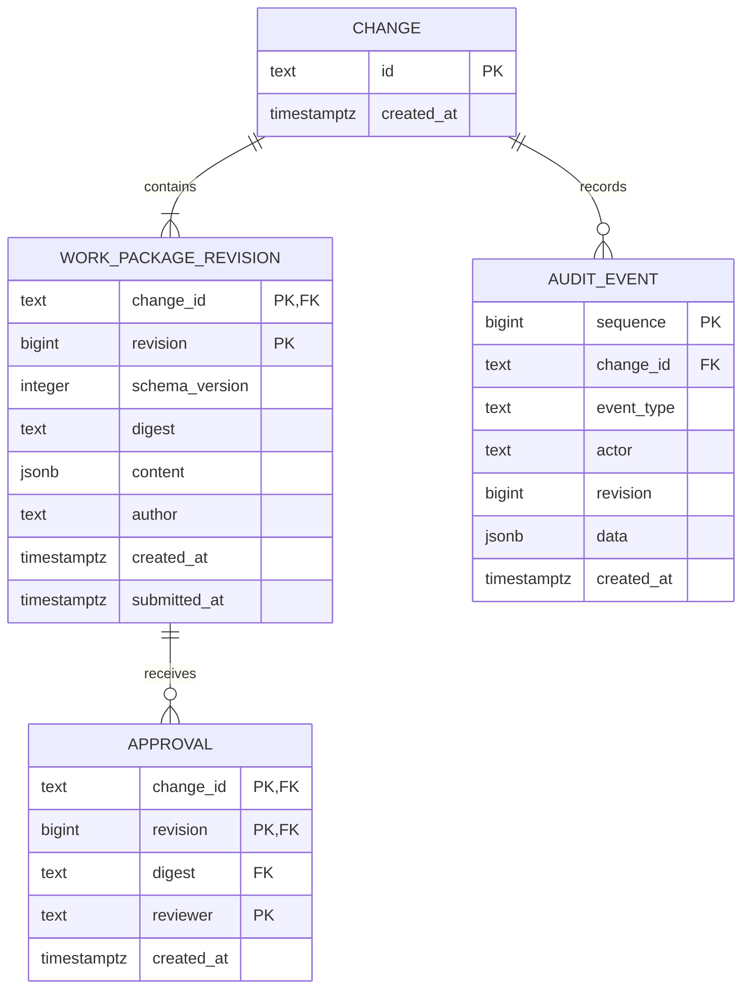
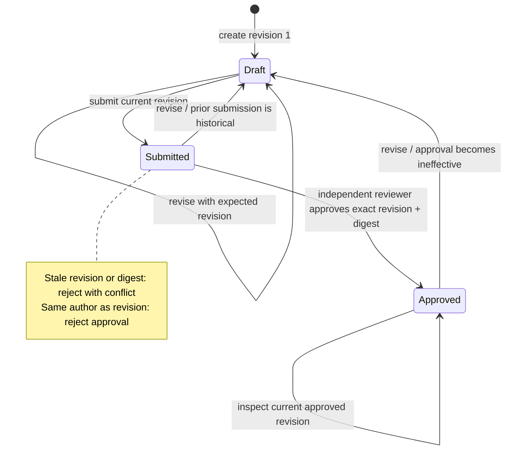
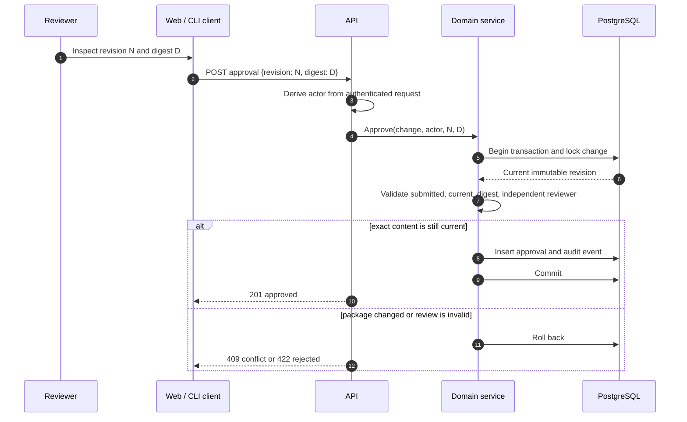
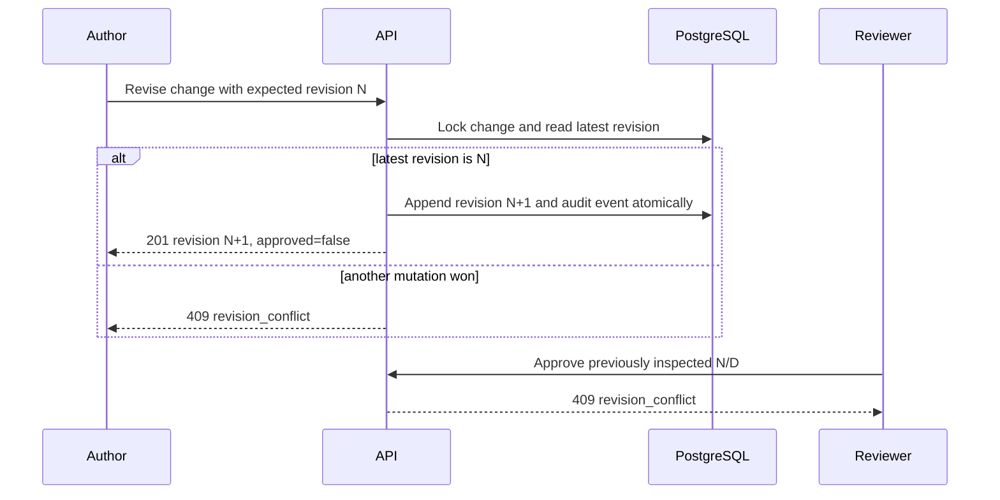

# Milestone 1: durable work-package review

## Scope and status

The current vertical slice supports creating an immutable package revision,
submitting the current revision, inspecting it, approving its exact revision and
digest, and appending a revision that makes the prior approval ineffective.

The Go CLI, HTTP API, domain service, PostgreSQL schema/store, and minimal React
inspector exist, with committed Go and frontend dependency locks. The Bubble Tea
TUI and automated full-process restart acceptance suite remain incomplete. Live
PostgreSQL tests cover the review lifecycle, concurrent edits, transactional audit
rollback, missing packages, and connection-pool reopen durability. A manual check
also verified persistence after restarting both PostgreSQL and the API.

## Domain model

A work package is the latest immutable revision plus an **effective** approval, if
one exists for the same `(change_id, revision, digest)`. Historical approval rows
are retained; the application never flips a freely writable `approved` column.

## Review lifecycle

`Approved` is derived, not assigned. Appending a revision transitions the current
view to `Draft` while leaving all historical evidence intact.

## Exact-revision approval sequence

The client must send what was displayed. It must not fetch a newer revision inside
an approval action. A `409` requires the reviewer to inspect the new revision.

## Edit and invalidation sequence

PostgreSQL advisory transaction locks serialize commands for one change. Optimistic
revision checks still define client-visible concurrency semantics. Commands for
unrelated changes remain independent.

## Command and endpoint map

| Intent | CLI | HTTP | Required concurrency input |
|---|---|---|---|
| Create | `conductor create` | `POST /api/v1/changes` | None |
| Inspect | `conductor show` | `GET /api/v1/changes/{id}` | None |
| Revise | `conductor revise` | `POST /api/v1/changes/{id}/revisions` | Expected revision |
| Submit | `conductor submit` | `POST /api/v1/changes/{id}/review-requests` | Inspected revision |
| Approve | `conductor approve` | `POST /api/v1/changes/{id}/approvals` | Inspected revision and digest |

The exact payload contract is maintained in `api/openapi.yaml`.

## Invariants

1. Revision numbers increase monotonically within a change.
2. Revision content is append-only and recoverable.
3. Digest is SHA-256 of Go's deterministic JSON encoding of the structured content.
4. Revision and audit event are committed in one transaction.
5. Only the current submitted revision can be approved.
6. A revision author cannot approve that revision.
7. Approval identity comes from the request context, never the approval payload.
8. An approval is effective only for its referenced current revision and digest.
9. Unknown content fields survive because content is stored as structured JSON.
10. Missing evidence or unavailable integrations cannot be represented as passing.

## Known limitations

- Local actor headers are not a production authentication mechanism.
- Package-level and repository-level authorization are not yet implemented.
- No Temporal workflow, assistant, GitLab, Linear, context, or runtime adapter runs.
- Shared discovery, historical revision inspection, and audit-query endpoints are
  available; see [Feature 002](../../specs/002-context-history/spec.md).
- Full API/database restart was checked manually; automated restart coverage is
  limited to reopening the database connection pool.
- The schema currently rejects duplicate content within a change; unchanged edits
  and exact content reverts need an explicit domain policy and error contract.
- The web inspector is minimal, and the Bubble Tea TUI is pending.
