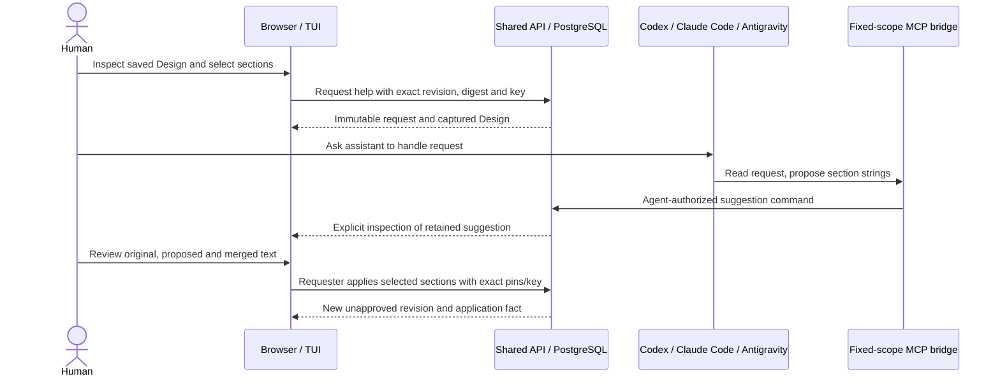

# Native Design assistance

**Status: implemented; PR review pending.** [Feature 020](../../specs/020-native-design-assistance/spec.md)
adds a bounded native-assistant path to guided Change authoring. The saved Design
is the input; this does not add a private conversation store or mutable shared draft.

The request, suggestion and application are immutable PostgreSQL facts. Authorization
locks, the corresponding fact and concise audit event share a transaction. Application
also commits the ordinary package revision and event in that transaction. There is
no model-running status or second execution sequencer. The native host runs its own
model session; hosted inference would require a separately qualified Temporal design.

| Fact | Authority and meaning |
|---|---|
| Request | A human author selects an exact saved revision and eligible text sections |
| Suggestion | An agent author supplies one set of requested section strings; it changes no Design |
| Application | The requesting human applies a selected subset to the still-matching base, creating an unapproved revision |
| Approval | Existing independent human review binds the newly inspected revision/digest |

The limited requester-only application rule preserves the existing independence
rule: the requesting/applying human is the revision author and cannot approve it.
Other humans cannot apply the request, and agents cannot request human assistance
or apply it. General contribution attribution across other command paths is unchanged.

Each command retains its exact input digest and idempotency key. Authorization
precedes replay. Retained matching results take precedence over later revision drift;
changed inputs conflict. Application overlays selected strings on server-held content,
preserving unknown structures and omitted keys. Structured legacy fields are excluded,
and unchanged or exact historical content reverts conflict rather than breaking a
revision uniqueness constraint. Existing digests and approvals are never rewritten.

The dedicated MCP profile exposes only access, assistance discovery/read and proposal.
The full bridge remains available under its existing capability contract. Neither
profile grants permissions; the authenticated API resolves current principal kind
and repository grants. Provider credentials stay with the native host, separate from
the Conductor agent token file. Readable handoffs identify a request without requiring
a user-authored JSON document.

Suggestion text and notes are unverified prose. The service records the Conductor
agent principal, not authenticated model provenance or the host's complete inputs.
This increment adds no intentional cross-repository source selector. A later feature
that incorporates related private source must carry derived-source access through
suggestion and revision reads before offering that workflow.

The broader [AI-DLC proposal](aidlc-plan-review.md) and vocabulary proposal remain
Proposed. This bounded native suggestion increment was pulled forward after guided
authoring because it can use the already-saved Design. General context selection,
embedded inference, provider login management and shared draft contribution policy
remain later work. See the [runbook](../operations/native-design-assistance.md) for
controls and actual qualification limits.
