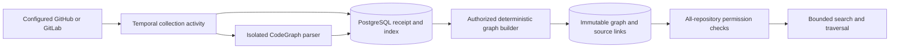

# Shared repository graph architecture

**Current:** immutable receipt-backed graph commands and native Go/manifest indexing.
Optional CodeGraph 1.6.0 extraction runs inside the existing trusted collection
activity. Optional full-source collection also acquires an exact Git bundle and bounded
whole-tree index. **Partial:** broader platform/language compatibility and deployment
profiles remain unfinished. See [source bundles](source-bundles.md).

PostgreSQL owns receipts, immutable indexes, graphs, source links and audit facts.
Temporal owns activity sequencing and retries. The graph builder performs no
external I/O; it projects already-stored facts in the graph command transaction.
The CodeGraph activity uses a pinned container image ID and never inherits provider,
API or database credentials. Its standard input is bounded source JSON, and its
output contains bounded structural metadata. No host paths or sockets are mounted.

Authorization is all-or-nothing for one graph. Revealing a caller but hiding its
callee could leak repository relationships or misleadingly imply that traversal
is complete. A snapshot is readable only while the principal can read every source
repository. Listing filters inaccessible snapshots before its keyset page limit.
A selected repository anchors the graph but does not grant access to related ones.

Native dependency edges connect uniquely declared module/package names across the
selected receipts. CodeGraph contributes upstream symbols and edges, retaining
heuristic/unspecified provenance rather than inventing compiler verification.
Nodes contain exact artifact digests and lines; source remains in the receipt.
Every source's branch freshness stays unknown. Gaps and truncation remain visible
in full inspection and filtered queries.

See the [feature specification](../../specs/007-repository-graph/spec.md),
[runbook](../operations/repository-graph.md), and
[integration research](codegraph-integration-research.md).

## Retained source inspection

Implemented: an authenticated client can read one retained artifact from any source
in its inspected graph through `GET /api/v1/repository-graphs/{id}/artifact` and
`GetRepositoryGraphArtifact`. The request captures the graph digest, repository,
collection, receipt digest, optional full-source digest and literal path. Every
repository in the graph must remain readable in the same transaction, including
sources other than the requested artifact. The workspace and anchor repository
stay fixed; a mismatched source tuple cannot widen coverage.

Selected-path receipts and retained full-source artifacts expose at most 64 KiB of
text per clean relative path (at most 1024 UTF-8 bytes). Responses preserve source
commit/digests, unknown freshness, individual missing/unavailable/truncated states,
`selected_paths` versus `full_source` coverage, and whole-source truncation. A path
not retained returns an explicit unavailable artifact. Reads never acquire newer
source, run repository commands or expose Git bundle bytes or credentials.

Signed-token/live-PostgreSQL acceptance covers related-repository source reads,
revocation of any graph endpoint, forged tuples and identity, path/query bounds,
selected-path gaps and real Git bundle text outside the selected-path receipt.
The latter uses an explicitly synthetic unsupported extraction fact; it proves
retention and authorization, not CodeGraph execution.
