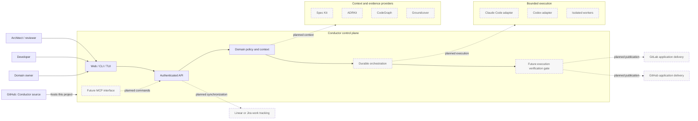
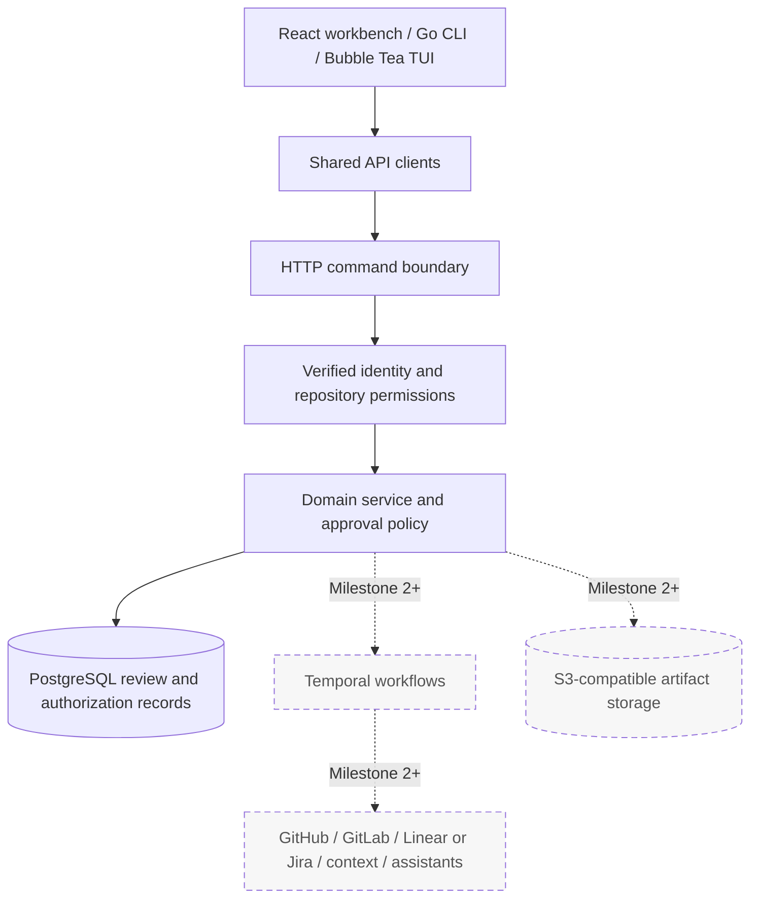
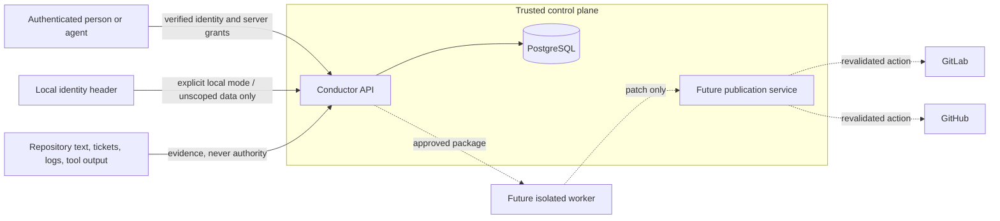

# Conductor system architecture

## Purpose and boundaries

Conductor turns engineering intent into revision-pinned work packages and, over
later milestones, coordinates context gathering, implementation, verification,
and delivery. It governs coding assistants rather than replacing them.

Conductor will manage application repositories on both GitHub and GitLab. Each
repository's future provider adapter will supply pull/merge requests, checks, and
delivery facts. Both follow the same Conductor
approval and evidence rules.

GitHub also hosts Conductor's own source. Project hosting is a separate
responsibility from managed application delivery, even when both use GitHub. See
the [repository provider plan](repository-providers.md) for scope and boundaries.

## Target system context

> **Status:** Durable review and authenticated workspace access through the API,
> CLI, browser, and interactive terminal are implemented. The browser uses OIDC
> sign-in; CLI and terminal credentials come from an explicitly selected token.
> MCP, execution, delivery adapters, and components with dashed borders are planned.
> Identity-provider compatibility has not been established beyond synthetic tests.

## Architectural layers

All interfaces invoke the same domain command path. The authenticated service
wraps those commands in a transaction that resolves the principal, checks workspace
membership and repository capabilities, and holds permissions through command
commit. PostgreSQL owns review state and authorization metadata. Temporal will
eventually own execution sequencing; a database projection of run progress must not
become a second workflow authority.

## Trust boundaries

`CONDUCTOR_AUTH_MODE=local` permits the `X-Conductor-Actor` header only on a
loopback-bound server, with access to unscoped local data. OIDC mode rejects that
header and verifies the configured HTTPS issuer, audience, and supported signed
access-token profile. It maps issuer/subject to server-owned principal records;
client role claims cannot alter human/agent kind or repository capabilities.

The browser, API, CLI, and terminal support authenticated review. Browser
login uses PKCE, one-use state, verified ID tokens, and protected PostgreSQL
sessions. [Browser setup](../operations/browser-sign-in.md) describes the exact
protocol and session limits. The terminal uses the existing API access-token
credential and keeps one verified principal, workspace, and repository per session.
It clears inspection after access failure and requires explicit access recovery.
Interactive CLI token acquisition and compatibility validation against real identity
providers remain pending.
Configuration and transport requirements are in the
[authenticated review guide](../operations/authenticated-review.md). Future workers
do not receive publication credentials. No execution or delivery integration runs.

## State ownership

| State | Authority | Current status |
|---|---|---|
| Package revisions, submissions, approvals, audit events | PostgreSQL | Implemented for local and authenticated review |
| Principals, workspace membership, canonical repository ownership, access grants | PostgreSQL | Implemented; operator-provisioned and audited |
| Workflow sequencing, waits, retries, cancellation | Temporal | Planned |
| Immutable large artifacts | S3-compatible storage | Planned |
| Application pull/merge requests, checks, pipelines, delivery facts | Configured GitHub or GitLab provider | Planned |
| Priority, assignment, and ticket planning workflow where configured | Selected Linear or Jira tracker | Planned |
| Cross-repository graph | Derived Conductor read model | Planned |
| Conductor source and project history | GitHub | Implemented externally |

## Delivery sequence

```mermaid
flowchart LR
    M1[1. Durable package review] --> Access[Authenticated API and CLI review]
    Access --> Browser[Browser sign-in]
    Browser --> Terminal[Authenticated terminal review]
    Terminal --> M2[2. Orchestration and context]
    M2 --> M3[3. One assistant to draft GitHub PR or GitLab MR]
    M3 --> M4[4. Assistant choice and Linear or Jira synchronization]
    M4 --> M5[5. Cross-repository runtime intelligence]
    M5 --> M6[6. Security, performance, bounded autonomy]

    classDef active fill:#e8f1ec,stroke:#244c3f,stroke-width:2px;
    classDef planned fill:#f7f7f7,stroke:#777,stroke-dasharray:6 4;
    class M1,Access,Browser,Terminal active;
    class M2,M3,M4,M5,M6 planned;
```

Authenticated review is implemented across these interfaces. The proposed next
increment is [durable context collection](durable-context.md): selected files from
an exact managed-repository commit, a shared immutable receipt, and explicit
attachment to a package. It defines outbox, reconciliation, cancellation, and
revocation boundaries before introducing Temporal or external adapters. Collection
permission remains an unresolved product decision. Agent execution remains disabled
pending its own verified identity, authorization, durable recovery, context, and
execution boundaries. Review access alone does not authorize execution.

Each workspace selects one tracker, Linear or Jira. Work-tracking integrations
link its tickets to packages and GitHub/GitLab delivery records across repositories.
Field ownership and explicit status mappings must prevent synchronization loops or
ticket changes from inventing approvals and verification results. See the
[work-tracking plan](work-tracking.md).
