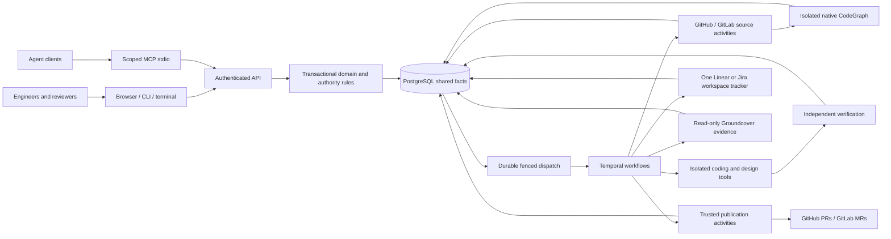
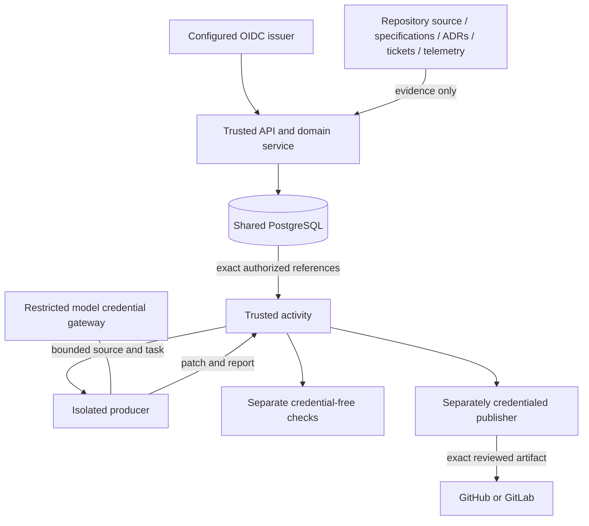

# Conductor system architecture

**Status: Implemented on the release integration branch within the tested bounds
in the [release contract](../full-release.md).** Implementation, verified local
protocol behavior, merge, deployment and production outcome remain separate.
The public review stack is not merged or deployed by this document.

## Purpose and system context

Conductor carries engineering intent through shared design, exact human review,
repository understanding, coordinated implementation, verification and trusted
publication. It governs coding assistants rather than replacing them. GitHub hosts
Conductor itself; each managed application repository independently selects the
supported GitHub or GitLab delivery profile.

All interfaces invoke common API/domain commands. PostgreSQL retains immutable
revisions, approvals, graph/source receipts, task artifacts, publication and tracker
facts, runtime criteria/evidence and concise audit records. Temporal alone sequences
activities. A database execution observation describes a timestamped observation
of Temporal; it is not a second workflow authority.

External reads and writes occur in activities. Durable outboxes bridge committed
intent and Temporal admission; bindings identify the actual cluster, namespace,
workflow and opaque inputs before dispatch. Fencing, retained receipts and explicit
reconciliation handle lost acknowledgments. A known missing history or unknown
cleanup state never silently creates a replacement run.

## Shared data and authority

| Concern | Owner and invariant |
|---|---|
| Human/agent identity | Verified issuer/subject resolves to an active PostgreSQL principal; token role claims and perspective selectors grant nothing |
| Workspace and repository access | Server-owned membership and canonical grants; every included source repository is checked inside the committing/read transaction |
| Design | Immutable package revision/digest; only an independent authorized human can approve it |
| Source and graph | Retained exact commits, artifact/bundle digests, explicit graph coverage and all-source permissions |
| Execution permission | A separate human authorizes the exact plan, source/design/profile/image pins, writable paths and checks |
| Overlapping work | Shared write claims remain until observed terminal execution, retained task outcomes and confirmed cleanup |
| Produced implementation | Isolated worker patches plus independently executed checks; failed reports remain inspectable |
| Publication | Separate trusted worker publishes only the exactly inspected artifact under current human authorization |
| Tracker planning fields | Selected Linear or Jira issue owns title, description, priority, assignee and status; Conductor owns its package/publication link projection |
| Runtime conclusions | Exact approved criteria evaluated against correlated complete telemetry for the captured deployment/window; broader production outcome stays unverified |
| Recovery and audit | PostgreSQL immutable records and Temporal retained history/bindings; neither source text nor credentials enter workflow history |

Each workspace chooses one tracker; Linear-to-Jira mirroring is not implemented.
A ticket status, source-recorded ADR status, successful assistant response or
provider deployment cannot substitute for a Conductor approval or passing check.
See [collaboration](collaboration.md), [repository providers](repository-providers.md)
and [work tracking](work-tracking.md) for the detailed boundaries.

## Trust boundaries

Repository-controlled commands have no publication, production or Conductor
credentials. The native coding adapter uses a task-scoped gateway with a bounded
provider capability profile; the independent check container has no provider key
or package-registry network access. Operator-selected immutable images define
available tools. Docker provides a container boundary; it is not a claim of VM
isolation or hostile multi-tenant production qualification.

Explicit local development mode accepts a local actor header only on loopback and
only for unscoped legacy/local packages. OIDC mode rejects that header and fails
closed. Browser sign-in uses HTTPS, authorization code/S256 PKCE, one-use state,
nonce verification and opaque server sessions. Cookie commands bind exact Origin
and session CSRF; scope or identity changes invalidate inspection. CLI/TUI/MCP use
an explicitly selected token file, fixed identity/scope and bounded requests.

Actual Keycloak 26.7.3 browser login is qualified separately from the strict RFC 9068
API bearer profile. Default Keycloak JWT and ID tokens remain rejected by that API
profile. Interactive CLI login/token refresh and arbitrary vendor compatibility
are not implied. See [browser setup](../operations/browser-sign-in.md) and
[actual provider qualification](../operations/keycloak-qualification.md).

## Native artifacts and provenance

Spec Kit and ADRKit run separately pinned native artifact/check commands in an
isolated image; their native content does not confer architectural authority.
CodeGraph 1.6.0 uses the user-selected upstream's native Rust extractor for supported
bounded source; coverage gaps and unknown freshness remain visible. Retained graph
source reads never fetch newer provider content or expose raw bundle credentials.
[Native design tools](../operations/design-tools.md),
[graph research](codegraph-integration-research.md) and
[coordinated execution](coordinated-execution.md) record exact pins and limits.

## Operations and completion

Release archives contain committed binaries, web assets, migrations, API contracts
and documentation with checksums. Operator migrations retain a checksum ledger;
backup/restore preserves shared facts into an explicitly empty quarantined target.
Private diagnostics expose bounded aggregate process/queue facts on a separate
literal loopback listener. Temporal connections support explicit local or verified
remote TLS/mTLS with retained runtime identity. See
[release operations](../operations/release.md) and
[Temporal connections](../operations/temporal-tls.md).

Actual local Git, native CodeGraph, Docker producers/checks, signed MCP, PostgreSQL,
Temporal restart, Chromium, PTY and Keycloak tests establish their recorded protocol
boundaries. Controlled HTTP fixtures exercise both delivery providers, both tracker
choices and exact runtime criteria, including ambiguous-write recovery. Live SaaS
writes, paid model inference, hosted Temporal operation and an actual Conductor
deployment remain unverified. See [complete acceptance](../operations/full-release-acceptance.md).

External object storage, live presence, interactive token acquisition and a second
learning/policy engine are not implemented or required to infer authority. Large
artifacts currently remain bounded PostgreSQL facts. Do not add another execution
state machine or describe planned storage as the current source of truth.
