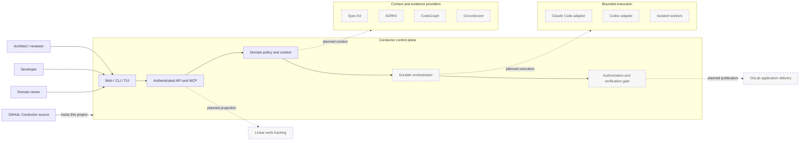
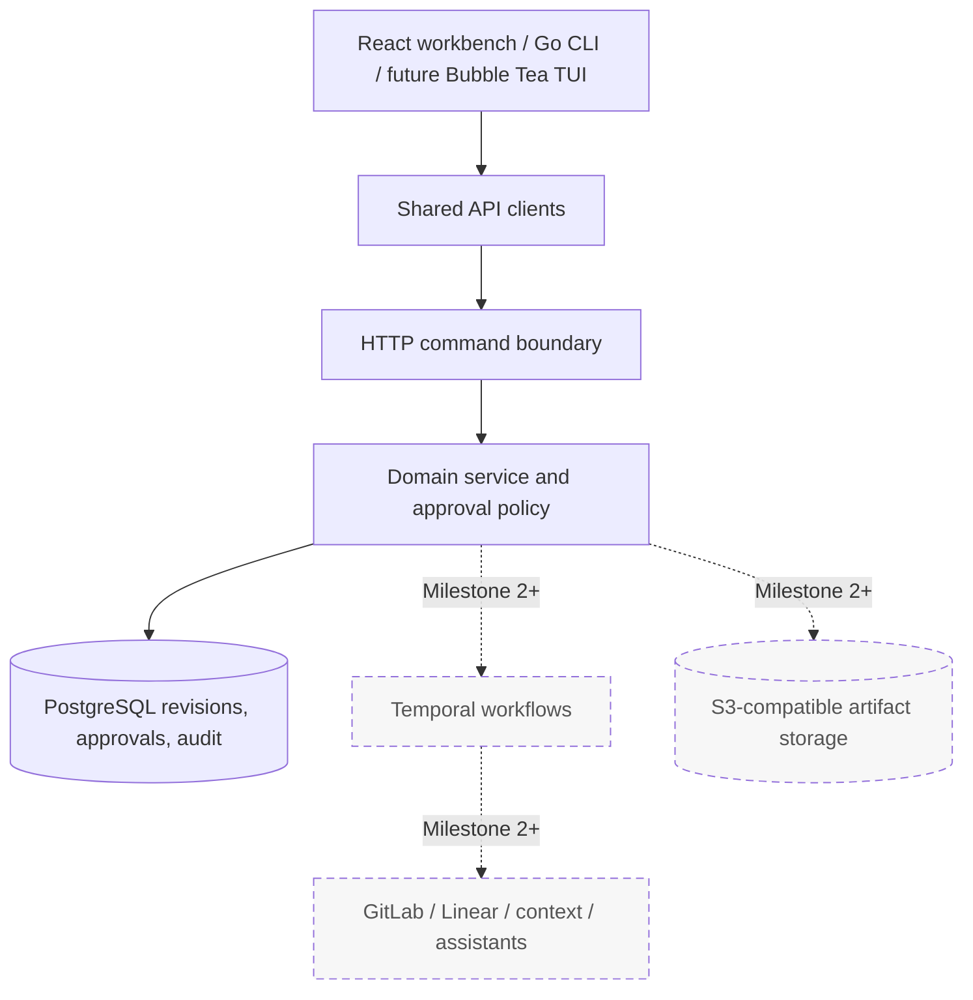
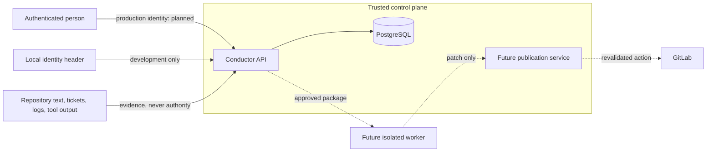
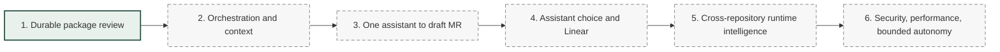

# Conductor system architecture

## Purpose and boundaries

Conductor turns engineering intent into revision-pinned work packages and, over
later milestones, coordinates context gathering, implementation, verification,
and delivery. It governs coding assistants rather than replacing them.

GitHub hosts Conductor's own source and project development. GitLab is a future
delivery integration for application repositories managed by Conductor. These are
separate responsibilities: Conductor must not treat its GitHub project state as an
application delivery fact.

## Target system context

> **Status:** The work-package control-plane slice is partial. Components with
> dashed borders are planned and are not available in the current release.

## Architectural layers

All interfaces must invoke the same domain command path. PostgreSQL owns review
state. Temporal will eventually own execution sequencing; a database projection of
run progress must not become a second workflow authority.

## Trust boundaries

The current `X-Conductor-Actor` header is intentionally local-only. Shared
deployment is blocked until organizational identity and repository-aware
authorization exist. Future workers do not receive publication credentials.

## State ownership

| State | Authority | Current status |
|---|---|---|
| Package revisions, submissions, approvals, audit events | PostgreSQL | Partial implementation |
| Workflow sequencing, waits, retries, cancellation | Temporal | Planned |
| Immutable large artifacts | S3-compatible storage | Planned |
| Application merge, pipeline, deployment facts | GitLab | Planned |
| Priority and assignment where configured | Linear | Planned |
| Cross-repository graph | Derived Conductor read model | Planned |
| Conductor source and project history | GitHub | Implemented externally |

## Delivery sequence

Agent execution remains disabled until the review foundation, production identity,
authorization, durable recovery, and context evidence meet their exit criteria.
